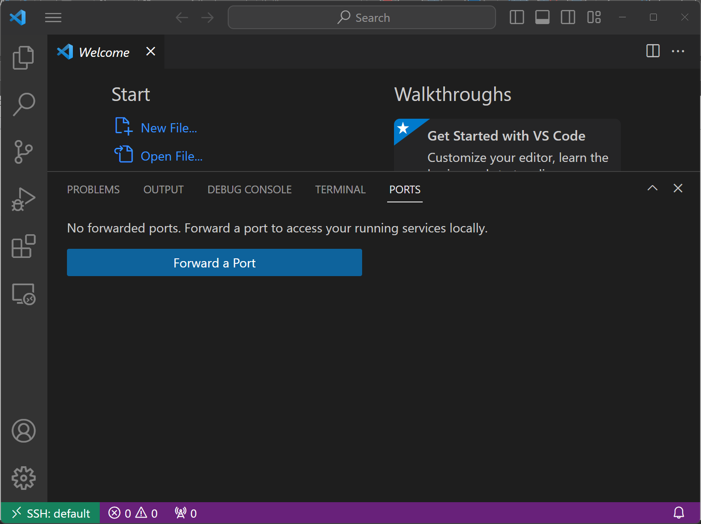
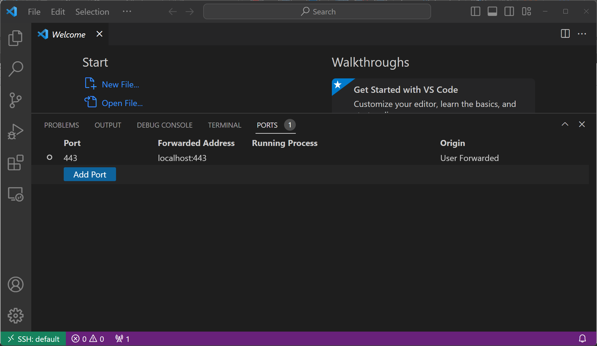
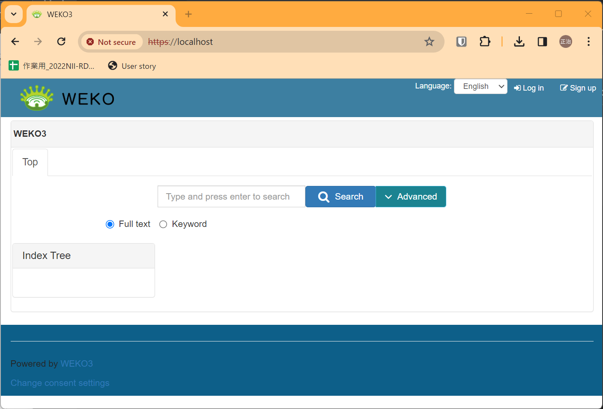
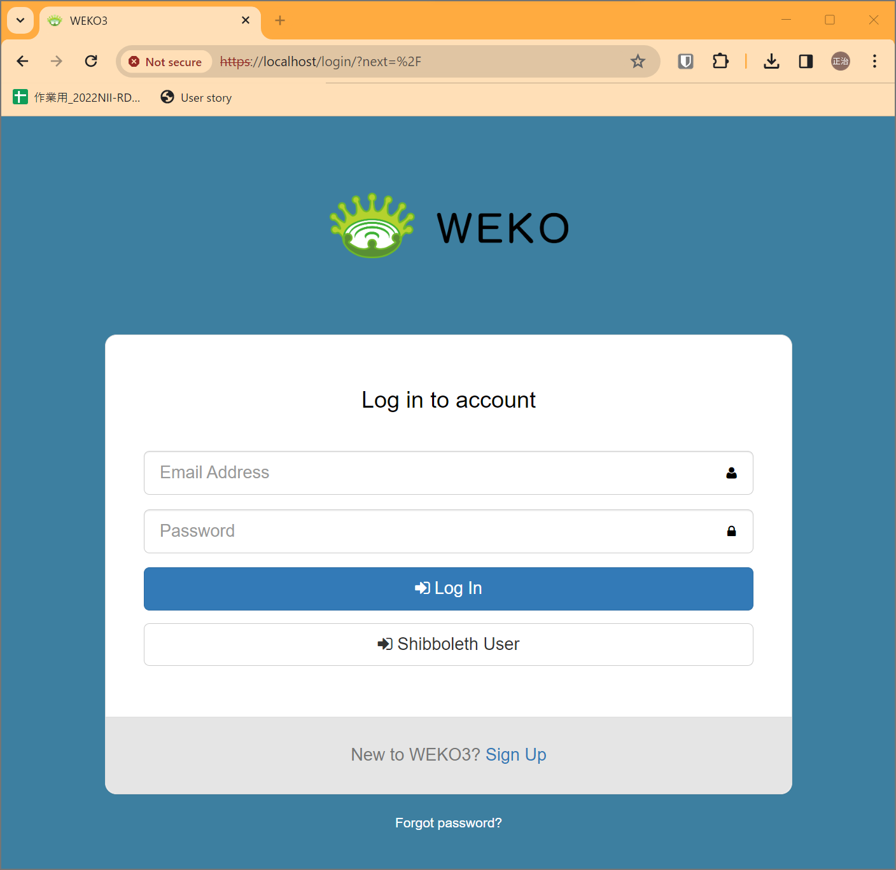

# build WEKO3

Clone WEKO3 to the local environment.

```
git clone https://github.com/RCOSDP/weko.git
```

Move to the cloned directory.

```
cd weko
```

Run the installation script.

```
bash install2.sh
```


```
$ docker-compose -f docker-compose2.yml ps
NAME                   COMMAND                  SERVICE             STATUS              PORTS
weko-elasticsearch-1   "/usr/local/bin/dock…"   elasticsearch       running             0.0.0.0:29201->9200/tcp, :::29201->9200/tcp, 0.0.0.0:29301->9300/tcp, :::29301->9300/tcp
weko-flower-1          "flower --broker=amq…"   flower              running             0.0.0.0:5501->5555/tcp, :::5501->5555/tcp
weko-nginx-1           "/usr/bin/supervisor…"   nginx               running             0.0.0.0:80->80/tcp, :::80->80/tcp, 0.0.0.0:443->443/tcp, :::443->443/tcp
weko-pgpool-1          "/opt/bitnami/script…"   pgpool              running             0.0.0.0:25401->5432/tcp, :::25401->5432/tcp
weko-postgresql-1      "docker-entrypoint.s…"   postgresql          running             0.0.0.0:32768->5432/tcp, :::32768->5432/tcp
weko-rabbitmq-1        "docker-entrypoint.s…"   rabbitmq            running             5671-5672/tcp, 15691-15692/tcp, 0.0.0.0:24301->4369/tcp, :::24301->4369/tcp, 0.0.0.0:45601->25672/tcp, :::45601->25672/tcp
weko-redis-1           "docker-entrypoint.s…"   redis               running             0.0.0.0:26301->6379/tcp, :::26301->6379/tcp
weko-web-1             "bash /code/scripts/…"   web                 running             0.0.0.0:5001->5000/tcp, :::5001->5000/tcp
weko-worker-1          "bash /code/scripts/…"   worker              running   
```





