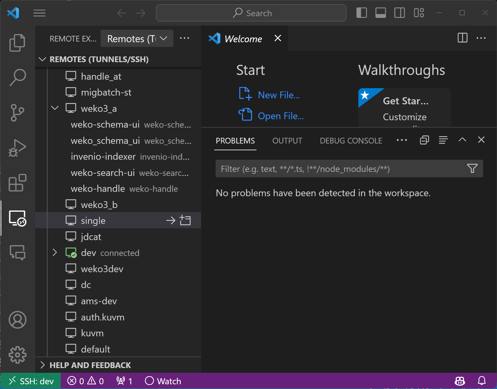
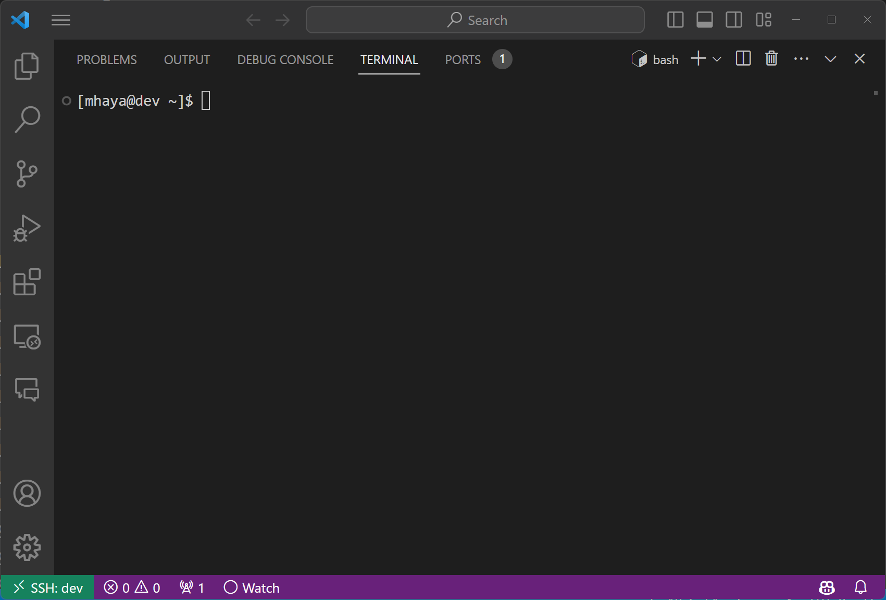
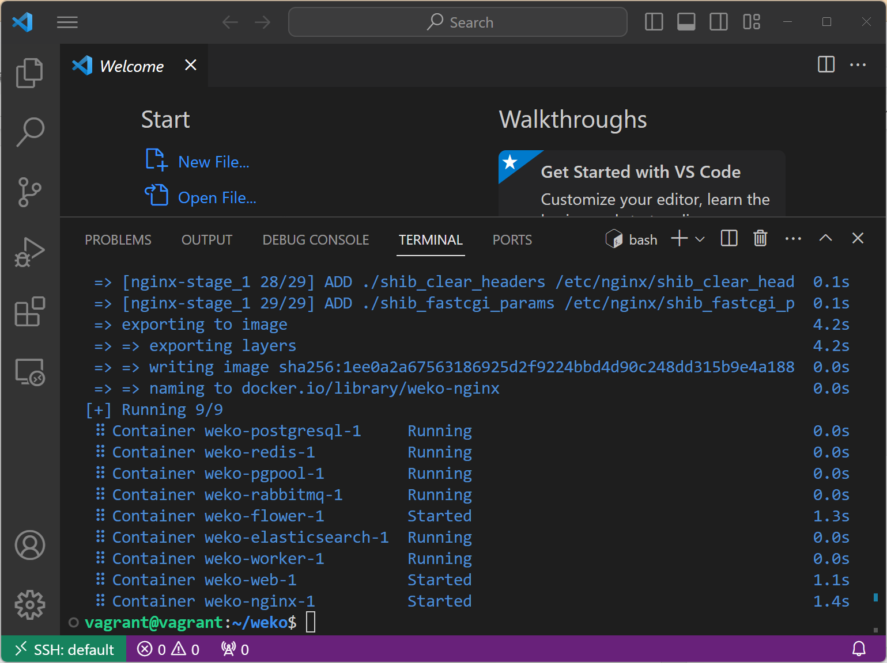

# build WEKO3

## connect to virtual machine

Run visual studio code and open "Remote Explorer".
Choose virtual machine config, then connect the server.



Open the terminal view in visual studio code.



## clone WEKO3 repository

Next, clone WEKO3 repository to the local environment.

```
git clone https://github.com/RCOSDP/weko.git
```

When completed cloning, move to the cloned directory.

```
cd weko
```

## build WEKO3

Run a script for instalation of WEKO3.

```
bash install2.sh
```

It takes time for all installation processes to be completed. When the installation is complete, the following screen will appear.



WEKO3 consists of 8 containers. Specifically, it consists of the nginx container, application container, celery woker container, elasticsearch container, redis server container, rabbitmq container, postgresql container, pgpool container, and flower container. 

To be sure, run the docker-compose command and check the running containers.

```
docker-compose -f docker-compose2.yml ps
```

If it is working correctly, it will appear as follows.

```
$ docker-compose -f docker-compose2.yml ps
NAME                   COMMAND                  SERVICE             STATUS              PORTS
weko-elasticsearch-1   "/usr/local/bin/dock…"   elasticsearch       running             0.0.0.0:29201->9200/tcp, :::29201->9200/tcp, 0.0.0.0:29301->9300/tcp, :::29301->9300/tcp
weko-flower-1          "flower --broker=amq…"   flower              running             0.0.0.0:5501->5555/tcp, :::5501->5555/tcp
weko-nginx-1           "/usr/bin/supervisor…"   nginx               running             0.0.0.0:80->80/tcp, :::80->80/tcp, 0.0.0.0:443->443/tcp, :::443->443/tcp
weko-pgpool-1          "/opt/bitnami/script…"   pgpool              running             0.0.0.0:25401->5432/tcp, :::25401->5432/tcp
weko-postgresql-1      "docker-entrypoint.s…"   postgresql          running             0.0.0.0:32768->5432/tcp, :::32768->5432/tcp
weko-rabbitmq-1        "docker-entrypoint.s…"   rabbitmq            running             5671-5672/tcp, 15691-15692/tcp, 0.0.0.0:24301->4369/tcp, :::24301->4369/tcp, 0.0.0.0:45601->25672/tcp, :::45601->25672/tcp
weko-redis-1           "docker-entrypoint.s…"   redis               running             0.0.0.0:26301->6379/tcp, :::26301->6379/tcp
weko-web-1             "bash /code/scripts/…"   web                 running             0.0.0.0:5001->5000/tcp, :::5001->5000/tcp
weko-worker-1          "bash /code/scripts/…"   worker              running   
```

## Configure port fowarding

Open "Ports" tab and click "Foward a Port" button.


Enter the information as shown in the picture below in the Ports tab.


Run a web browser and open "https://localhost". The following screen will appear on your browser screen.


This completes the installation of WEKO3. In the next step we will explain how to build a repository.
