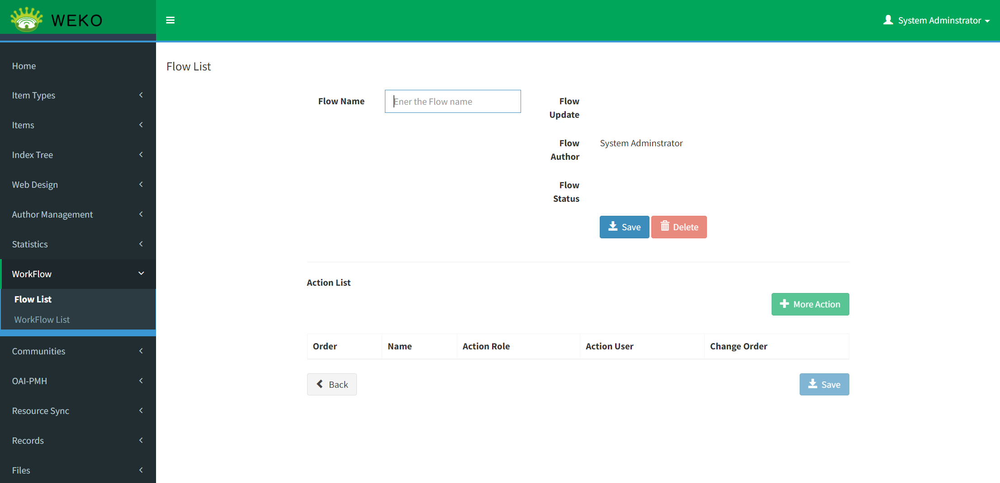
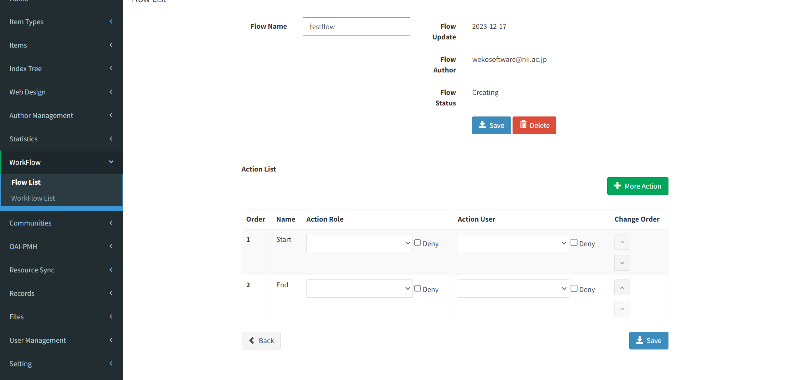
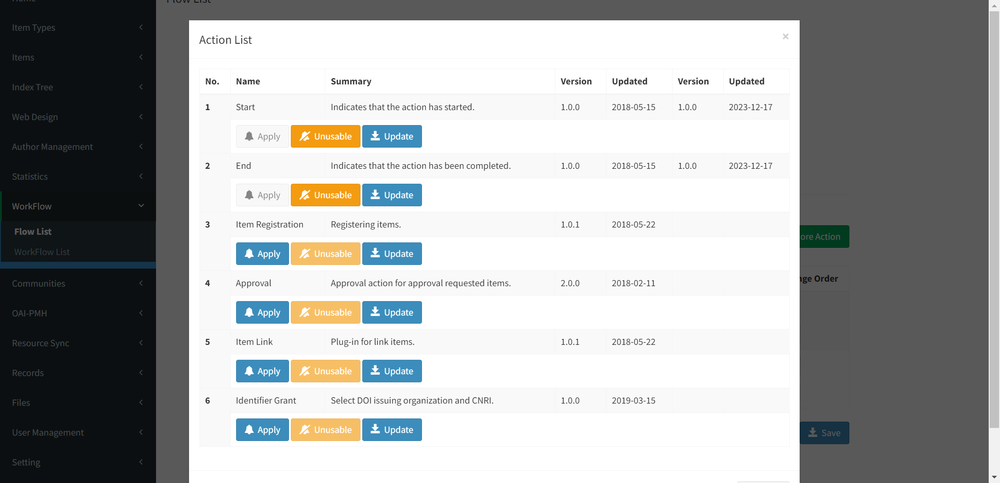
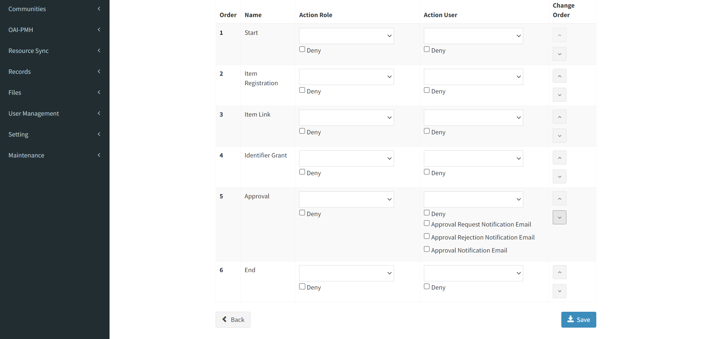
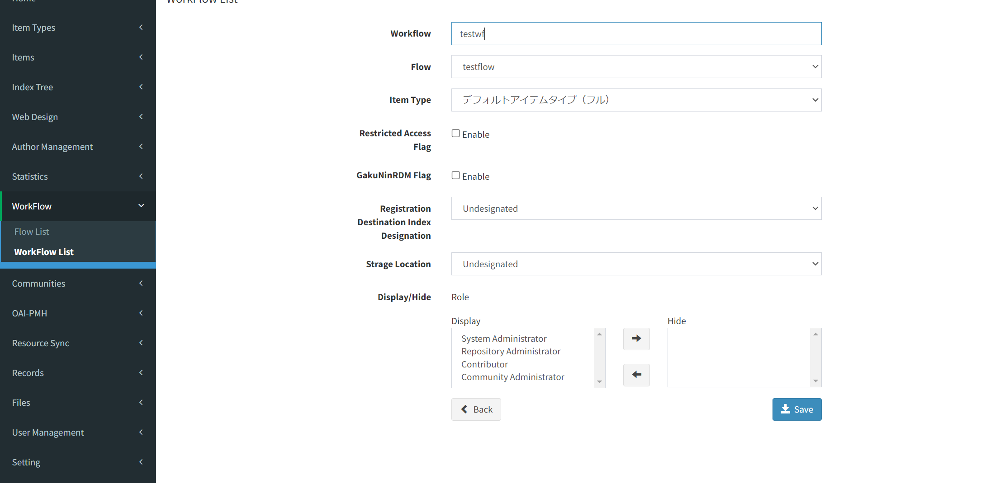
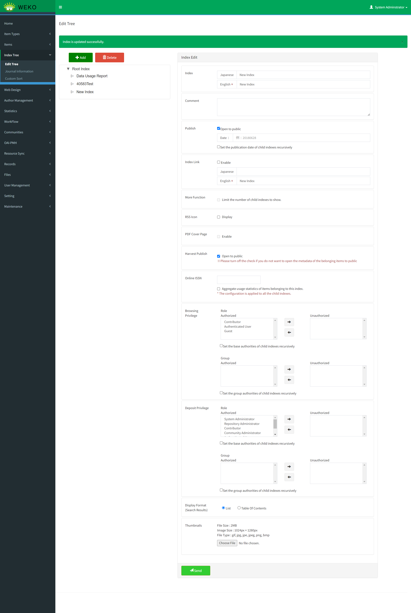

# Configure repository workflow

## Define a flow for item registration

Log in to WEKO3 as "System Administrator" or "Repository Administrator".

Go to the Administration page from the menu.

Open the left menu in the order of "Workflow" and "Flow List".

Click on the "Create Flow" button to create a new "Flow".

First, enter the "Flow Name" and click the "Save" button to save it. Next, click the "More Action" button to select an action to add to the "Flow. 

Arrange the actions as shown below and click the "Save" button at the bottom.

## Define a workflow for item registration

Log in to WEKO3 as "System Administrator" or "Repository Administrator".

Go to the Administration page from the menu.

Open the left menu in the order of "Workflow" and "WorkFlow List".

Click on the "Create WorkFlow" button to create a new "WorkFlow".

Set the "Flow" to the Flow you just created and select "デフォルトアイテムタイプ（フル）" for the item type.

## Define a index for item registration

Log in to WEKO3 as "System Administrator" or "Repository Administrator".

Go to the Administration page from the menu.

Open the left menu in the order of "Index Tree" and "EditTree".

Click on "Root Index" and click the "Add" button to add a new Index.

Change the added Index name and check "Open to public" checkbox button, Then click "Sending" button for saving changing parameters of added index.

This completes the minimum required setup for item registration.

