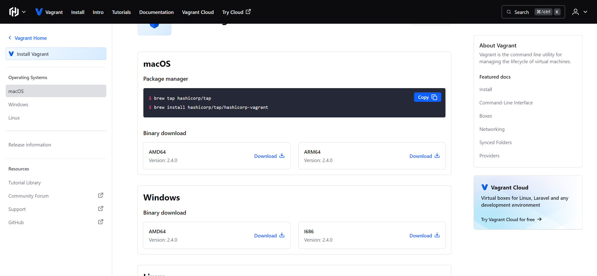
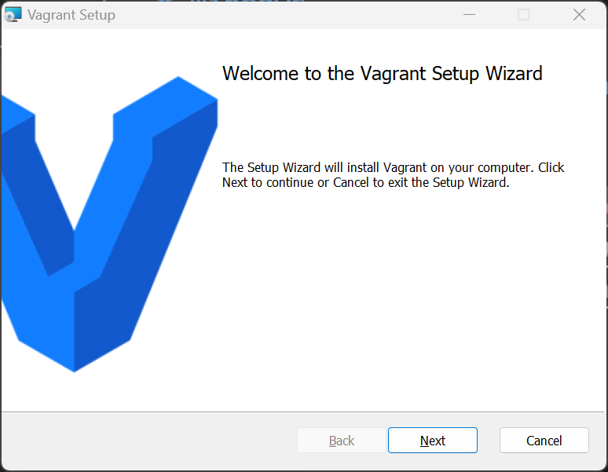
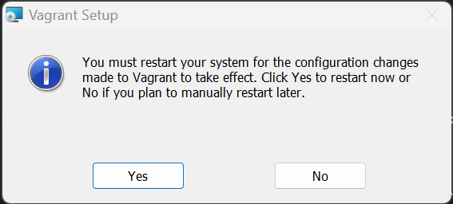

# Install vagrant in Windows

Next, install vagrant, which allows you to easily build a development environment in a virtual machine environment.

Download the vagrant installer from developer.hashicorp.com. Go to [https://developer.hashicorp.com/vagrant/install?product_intent=vagrant](https://developer.hashicorp.com/vagrant/install?product_intent=vagrant) in your browser.

Download the installer for Windows; note that there are installers for different CPU architectures.

After downloading, install vagrant application.

Follow the installer's instructions to restart your computer.

When complete, proceed to the [next step](./install_openssh_in_windows.md).