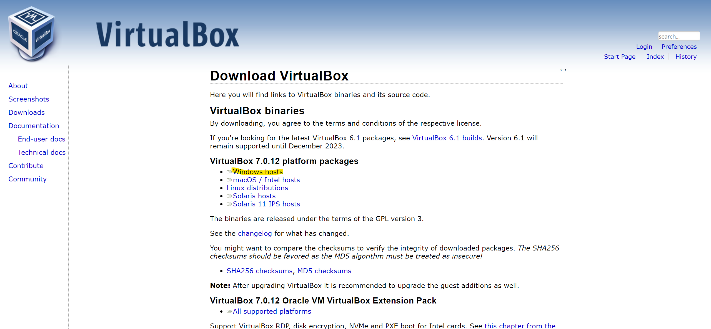

# Install virtualbox in Windows

Download the installer for Windows. Click on the link marked in yellow in the following picture.

After downloading, install virtualbox application by the installer.

Follow the installer's instructions to proceed with the installation. When complete, proceed to the [next step](./install_vagrant_in_windows.md).

