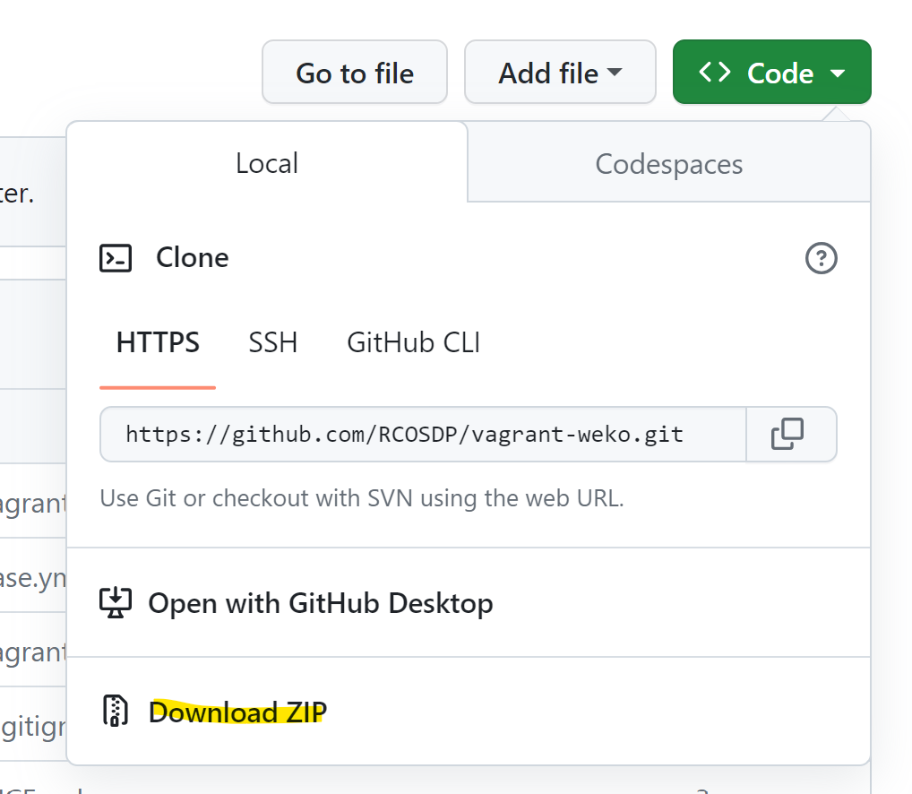
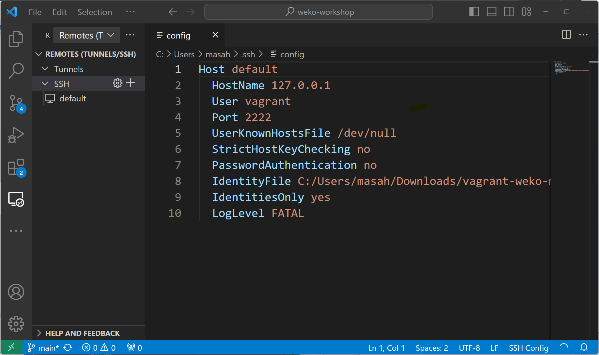

# Setup vagrant-weko

open https://github.com/RCOSDP/vagrant-weko

download repository zip file from github repository.



Extract the downloaded package in any directory.

open command prompt and move the directory.

move "single" directory in the directory.

run vagrant up command then virutual machine environment is built.

```
>vagrant up
Bringing machine 'default' up with 'virtualbox' provider...
==> default: Importing base box 'bento/ubuntu-20.04'...
==> default: Matching MAC address for NAT networking...
~ snip ~
```


```
>vagrant status
Current machine states:

default                   running (virtualbox)

The VM is running. To stop this VM, you can run `vagrant halt` to
shut it down forcefully, or you can run `vagrant suspend` to simply
suspend the virtual machine. In either case, to restart it again,
simply run `vagrant up`.

```


```
>vagrant ssh-config
Host default
  HostName 127.0.0.1
  User vagrant
  Port 2222
  UserKnownHostsFile /dev/null
  StrictHostKeyChecking no
  PasswordAuthentication no
  IdentityFile C:/Users/masah/Downloads/vagrant-weko-master/vagrant-weko-master/single/.vagrant/machines/default/virtualbox/private_key
  IdentitiesOnly yes
  LogLevel FATAL
```

```
cd %HOMEDRIVE%%HOMEPATH%
```

```
>code .ssh\config
```



```
>vagrant suspend
==> default: Saving VM state and suspending execution...
```