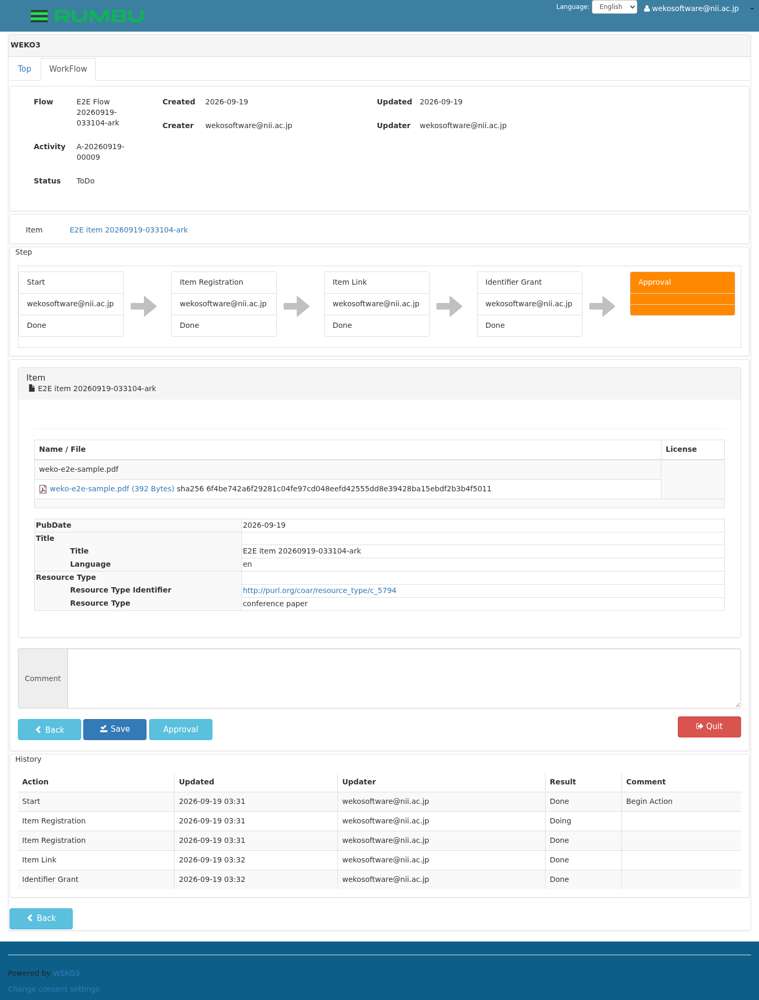
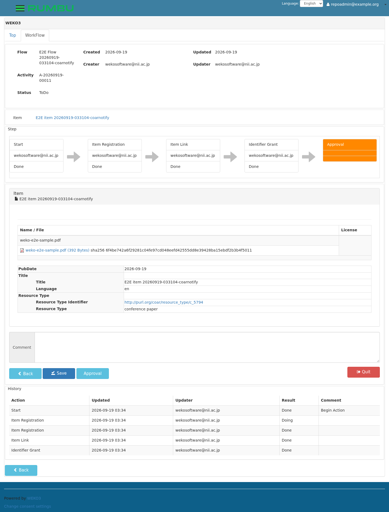
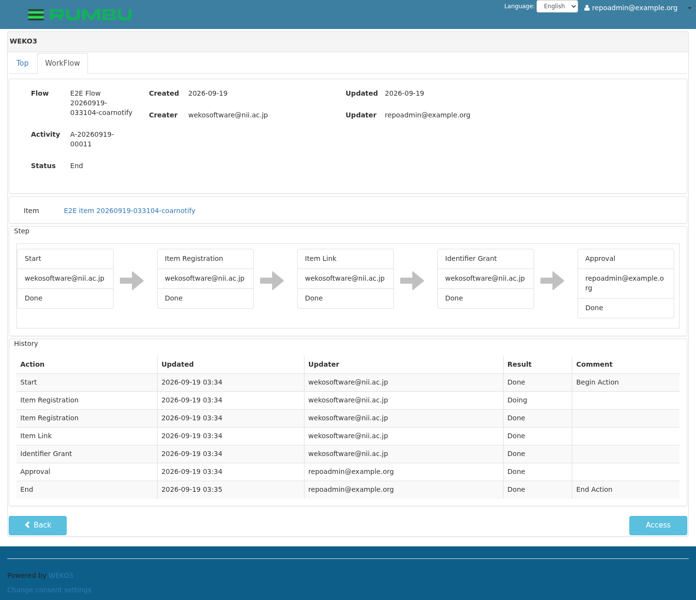
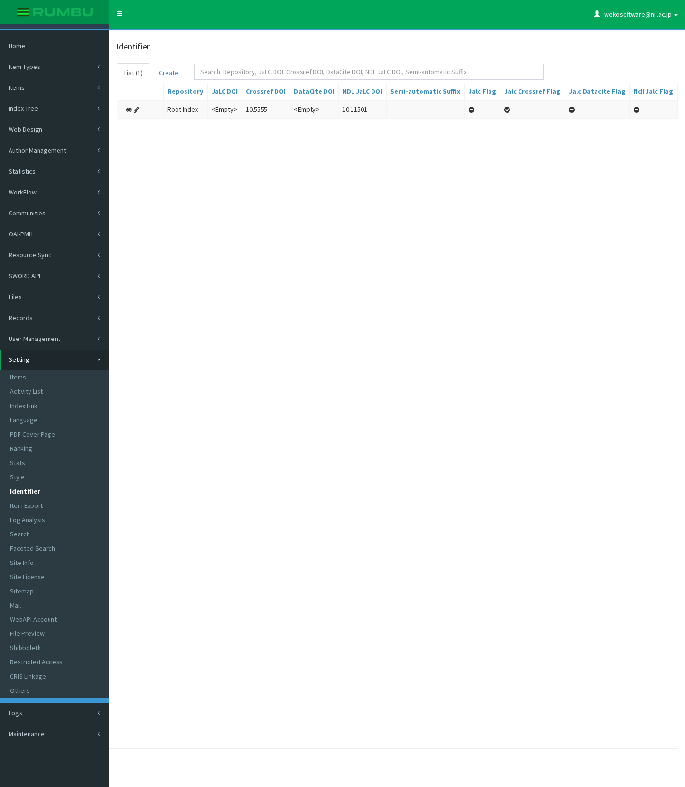
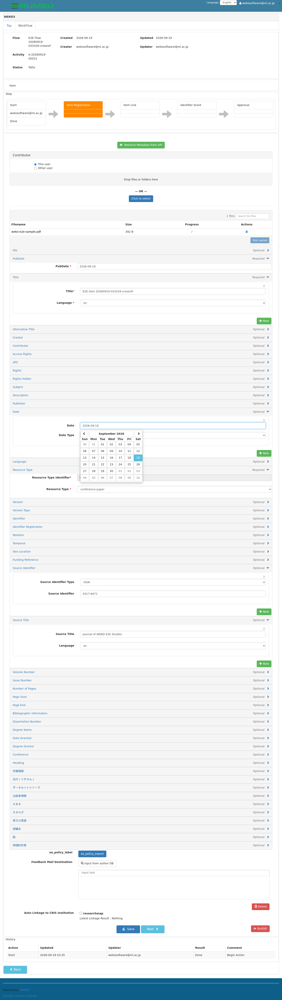
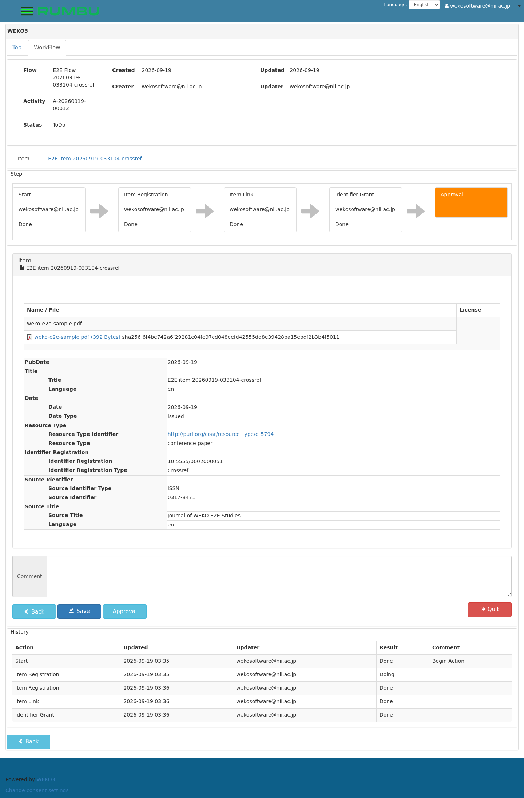
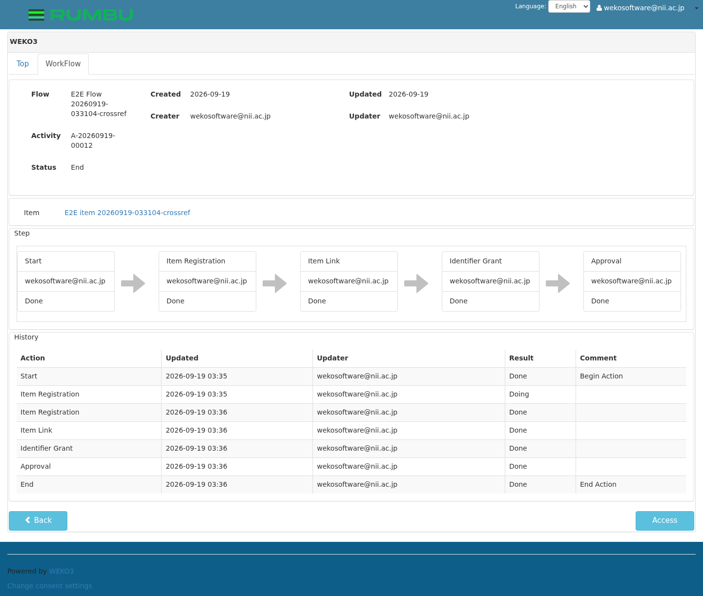
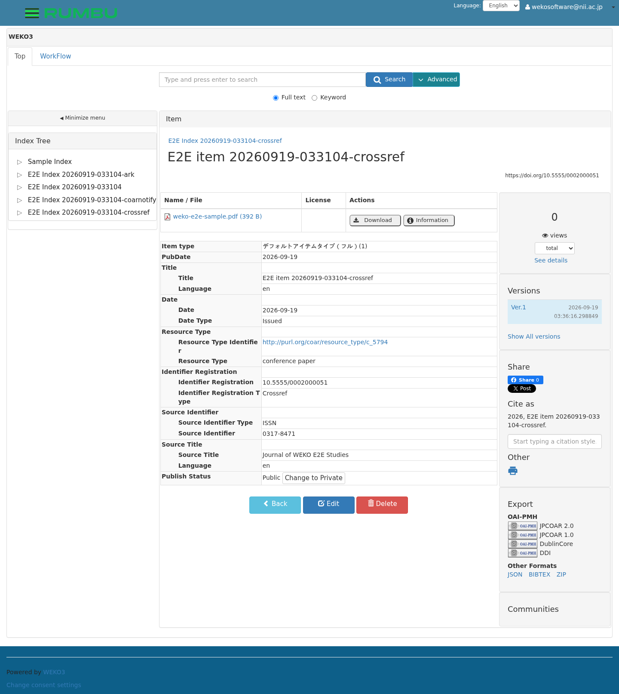

# E2E test run report (the base flow)

日本語版: [`README.ja.md`](README.ja.md)

A record of running [`../tests/test_basic_publish.py`](../tests/test_basic_publish.py)
against an instance brought up by `install.sh`. The test takes the
screenshots itself as it goes, so re-running it refreshes them in place and
this report cannot drift from the code.

## Result

| | |
| --- | --- |
| Run at | 2026-09-19 03:31:03 – 03:36:41 (UTC) |
| Run id | `20260919-033104` |
| Result | **37 passed, 2 skipped** (337.38 s) |
| Against | `https://localhost` (`install.sh` / `docker-compose2.yml`) |
| Suites | base, `ark` (against the stand-in ARK server), `coarnotify`, `crossref` |
| Cleaned up with | `./e2ectl clean --hard`; the database, and the inbox, went back to how `install.sh` left them |

```
============================= test session starts ==============================
platform linux -- Python 3.11.12, pytest-9.1.1, pluggy-1.6.0
rootdir: /home/mhaya/weko-workshop/e2e
configfile: pytest.ini
collected 37 items

tests/test_basic_publish.py::test_01_login PASSED
tests/test_basic_publish.py::test_02_create_index PASSED
tests/test_basic_publish.py::test_03_define_flow PASSED
tests/test_basic_publish.py::test_04_define_workflow PASSED
tests/test_basic_publish.py::test_05_start_activity PASSED
tests/test_basic_publish.py::test_06_register_metadata PASSED
tests/test_basic_publish.py::test_07_designate_index PASSED
tests/test_basic_publish.py::test_08_item_link PASSED
tests/test_basic_publish.py::test_09_identifier_grant PASSED
tests/test_basic_publish.py::test_10_approve PASSED
tests/test_basic_publish.py::test_11_record_is_registered PASSED
tests/test_basic_publish.py::test_12_record_is_public PASSED
tests/test_basic_publish.py::test_13_record_is_in_index PASSED

tests/test_ark_mint.py::test_01_login PASSED
tests/test_ark_mint.py::test_02_set_up PASSED
tests/test_ark_mint.py::test_03_register_item PASSED
tests/test_ark_mint.py::test_04_ark_was_minted PASSED
tests/test_ark_mint.py::test_05_ark_is_the_permalink PASSED
tests/test_ark_mint.py::test_06_ark_is_published PASSED

tests/test_coar_notify.py::test_01_login PASSED
tests/test_coar_notify.py::test_02_the_instance_announces_its_inbox PASSED
tests/test_coar_notify.py::test_03_notifications_are_not_public PASSED
tests/test_coar_notify.py::test_04_the_approver_can_read_their_notifications PASSED
tests/test_coar_notify.py::test_05_set_up PASSED
tests/test_coar_notify.py::test_06_send_the_item_for_approval PASSED
tests/test_coar_notify.py::test_07_the_approver_is_offered_the_item PASSED
tests/test_coar_notify.py::test_08_the_approver_approves PASSED
tests/test_coar_notify.py::test_09_the_registrant_is_told_it_was_approved PASSED
tests/test_coar_notify.py::test_10_the_user_can_choose_how_to_be_notified PASSED

tests/test_crossref_doi.py::test_01_prefix_is_set PASSED
tests/test_crossref_doi.py::test_02_set_up PASSED
tests/test_crossref_doi.py::test_03_register_item PASSED
tests/test_crossref_doi.py::test_04_choose_crossref_grant PASSED
tests/test_crossref_doi.py::test_05_approve PASSED
tests/test_crossref_doi.py::test_06_doi_was_granted PASSED
tests/test_crossref_doi.py::test_07_doi_is_the_permalink PASSED
tests/test_crossref_doi.py::test_08_doi_is_published PASSED
tests/test_crossref_doi.py::test_09_deposit_was_recorded SKIPPED
tests/test_crossref_doi.py::test_10_deposit_reached_crossref SKIPPED

============ 37 passed, 2 skipped, 20 warnings in 337.38s (0:05:37) ============
```

The two skips are the Crossref deposit: this instance was given no
Crossref account, so WEKO grants the DOI and sends nothing, which is the
documented behaviour. The deposit path is verified separately, below.

The warnings are all `InsecureRequestWarning` for the self signed
certificate, and say nothing about the behaviour under test.

## The environment

```
suite     : weko-workshop  feature/e2e-tests  61e0174
WEKO      : wekov2  feature/nii_WACREN_crossref_doi  594e070cf
python    : 3.11.12 (the side running the tests)
playwright: 1.63.0 / chromium-1243
pytest    : 9.1.1
requests  : 2.34.2 / beautifulsoup4 4.15.0
```

| Service | Image | State |
| --- | --- | --- |
| web | wekov2-web | Up |
| worker | wekov2-worker | Up |
| nginx | wekov2-nginx | Up |
| elasticsearch | wekov2-elasticsearch | Up |
| postgresql | postgres:12 | Up |
| pgpool | pgpool/pgpool:4.2.2 | Up |
| redis | redis:7.4.1 | Up |
| rabbitmq | rabbitmq:4.0.2 | Up |
| mongo | mongo:7.0.14 | Up |
| inbox | wekov2-inbox | Up |
| flower | mher/flower:0.9.5 | Up |

What this run created -- five resources per suite, named apart so that
four suites can share one session:

| Suite | index | flow / workflow | activity | item |
| --- | --- | --- | --- | --- |
| base | `1789788748142` | `80fe7b37…` / `3e1c6c93…` | `A-20260919-00010` | `2000049` |
| `ark` | `1789788681275` | `b8003d70…` / `e10b1a8b…` | `A-20260919-00009` | `2000048` |
| `coarnotify` | `1789788837713` | `a6419b6e…` / `ef72e531…` | `A-20260919-00011` | `2000050` |
| `crossref` | `1789788922177` | `efd70637…` / `b3f63b3e…` | `A-20260919-00012` | `2000051` |

What the optional suites were after:

| | |
| --- | --- |
| ARK minted | `ark:/99999/fk400002` |
| Crossref DOI granted | `10.5555/0002000051` |
| COAR Notify sent | 5 notifications: one approval request per suite that registered an item, and the approval announcement the `coarnotify` suite asked for |

---

## The base suite, step by step

### 01. Log in (test_01_login)

As the system administrator `wekosoftware@nii.ac.jp`.


### 02. Create the test index (test_02_create_index)

Create the index and publish it. The admin Index Tree shows
`E2E Index 20260919-033104` next to the shipped `Sample Index`.

A newly created index is private, which is why this step publishes it;
without that, step 12 fails.


### 03. Define the test flow (test_03_define_flow)

Six actions in order: Start / Item Registration / Item Link / Identifier
Grant / Approval / End. The flow's status is `Available`.


### 04. Define the test workflow (test_04_define_workflow)

The item type デフォルトアイテムタイプ（フル） together with the flow from
step 03. **No index is designated** on the workflow: one that names an
index designates it by itself and the screen in step 07 never appears.


### 05. Start the activity (test_05_start_activity)

The workflow appears in the list of workflows an activity can start on.


Starting it opens the activity on Item Registration.


### 06. Fill the metadata (test_06_register_metadata)

Attach the sample PDF and fill what this item type requires: PubDate,
Title and Resource Type.


### 07. Designate the index (test_07_designate_index)

Tick `E2E Index 20260919-033104` in the index tree; DESIGNATE INDEX shows
it.


### 08. Item link (test_08_item_link)

Link no other item, and move on.


### 09. Identifier grant (test_09_identifier_grant)

The base test grants no DOI; `Not Grant` is what is selected. A DOI
belongs in a derived suite -- there is a worked example in
`works/crossref-doi-manual/e2e/`.


### 10. Approve, which publishes (test_10_approve)

The approval screen.


Approving takes the activity to End: all six actions Done, and the history
running from Start to End. This is where the item is registered and
published.


### 11. The item is registered (test_11_record_is_registered)

`/records/2000049` exists and shows the title the run registered.


### 12. The item is published (test_12_record_is_public)

The same page from a browser context that has **never logged in** -- note
`Log in` in the top right. The title, the file and the item type
デフォルトアイテムタイプ（フル） are all there, which is what "published"
means.


### 13. Search finds it (test_13_record_is_in_index)

Still anonymous, search the index the run created: `Found 1 result.`
Indexing is asynchronous, so this is the one step that waits -- up to three
minutes -- and it is also what shows the worker and Elasticsearch are
doing their job.


---

## The `ark` suite

Run against the stand-in ARK server -- `e2ectl ark-stub enable` -- because
this instance has no ARK server of its own. The same suite run against a
real one, configured with `e2ectl ark-account enable`, is what the
"Other environments" table below records.

### Register an item, granting no DOI (test_03)

The ARK is minted on the way through, when Item Registration completes,
so nothing on screen asks for one.




### The item carries an ARK (test_04, test_05)

The permalink of an item with no DOI and no CNRI is its ARK, so the
record page is where a minted ARK shows up -- here `ark:/99999/fk400002`,
under the NAAN this environment was configured for.


---

## The `coarnotify` suite

WEKO turns workflow events into COAR Notify messages and POSTs them to the
LDN inbox -- the `inbox` container of this stack -- and reads them back
for the person they were addressed to at `GET /api/notifications`.

**Who receives what is the point.** WEKO leaves the person who acted out
of the notification about their own action, so this suite uses two
accounts: `wekosoftware@nii.ac.jp` registers, and
`repoadmin@example.org` -- the repository administrator approval
requests go to -- approves.

### The site announces its inbox (test_02)

```console
$ curl -sI --insecure https://localhost/ | grep -i '^link:'
Link: <https://weko3.example.org/inbox>; rel="http://www.w3.org/ns/ldp#inbox"
```

The URL is built from `THEME_SITEURL`, which is what the instance calls
itself and need not be the address the run is testing -- so the suite
fetches a notification by its *path* from the instance under test. WEKO
adds the header to a HEAD of the top page and not to a GET, which is what
the step asks for accordingly.

A visitor who has not logged in gets a 401 from `/api/notifications`
rather than somebody else's notifications (test_03).

### The item goes to the approver (test_06, test_07)

Moving on from the identifier grant puts the activity on the Approval
action, which is where WEKO offers it to the approvers.


Read back as `repoadmin@example.org`, and then fetched from the inbox:

```json
{
  "id": "urn:uuid:2d6758d5-ff84-44ba-a23d-2c3e8e3c3122",
  "@context": ["https://www.w3.org/ns/activitystreams", "https://coar-notify.net"],
  "type": ["Offer", "coar-notify:EndorsementAction"],
  "origin": {"id": "https://localhost/", "inbox": "…/inbox", "type": "Service"},
  "target": {"id": "https://weko3.example.org/users/2", "inbox": "…/inbox", "type": "Person"},
  "object": {"id": "https://localhost/records/2000050",
             "type": ["Page", "sorg:WebPage"],
             "name": "E2E item 20260919-033104-coarnotify"},
  "actor":  {"id": "https://weko3.example.org/users/1", "type": "Person"},
  "context": {"id": "https://localhost/workflow/activity/detail/A-20260919-00011",
              "type": ["Page", "sorg:WebPage"]}
}
```

`context` is what ties a notification to one activity, and so the only
thing in the payload that names *this* run's; the suite finds its own by
it rather than by taking whatever arrived last.

### The approver approves (test_08)

The approver opens the activity in a browsing context of their own. WEKO
holds an activity for the window that has it open, so the registrant
moves off the screen first -- as a person handing work over would -- and
the approver lets go of anything an earlier run left them holding.





### The approval goes back to the registrant (test_09)

```
urn:uuid:fce8aee7-18a4-4e52-9ffc-7c5ce3c5d396
  Announce+coar-notify:EndorsementAction
  -> https://weko3.example.org/users/1
  about 'E2E item 20260919-033104-coarnotify' (https://localhost/records/2000050)
```

`users/1` is the registrant, and the `actor` is `users/2` -- the account
the offer was addressed to. The step checks exactly that: the person the
item was offered to is the person the announcement names as having
endorsed it, and the announcement did not go back to the person who made
it.

`./e2ectl inbox --run <run id>` shows both ends of the loop:

```console
$ ./e2ectl inbox --run 20260919-033104
registrant: wekosoftware@nii.ac.jp
  announced inbox: https://weko3.example.org/inbox
  2026-09-19 03:35:00  … Announce+…EndorsementAction -> …/users/1 about 'E2E item 20260919-033104-coarnotify'
  1 of 1 notification(s) shown
approver: repoadmin@example.org
  2026-09-19 03:34:43  … Offer+…EndorsementAction -> …/users/2 about 'E2E item 20260919-033104-coarnotify'
  2026-09-19 03:36:10  … Offer+…EndorsementAction -> …/users/2 about 'E2E item 20260919-033104-crossref'
  2026-09-19 03:32:06  … Offer+…EndorsementAction -> …/users/2 about 'E2E item 20260919-033104-ark'
  2026-09-19 03:33:29  … Offer+…EndorsementAction -> …/users/2 about 'E2E item 20260919-033104'
  4 of 40 notification(s) shown
```

Four offers, because **every** suite that registers an item sends one --
the base suite and the two identifier suites included. The announcement
is the `coarnotify` suite's own, and the only one in this run, because it
is the only suite that has somebody other than the registrant approve.

### How the user asks to be told (test_10)


Web push and Email, per user. The suite checks the screen offers both;
turning web push on needs a browser notification permission and VAPID
keys on the inbox container, which this stack does not have set.

---

## The `crossref` suite

### The prefix is configured (test_01)

The suite turns the Crossref grant on and sets the prefix, and puts both
back the way it found them when it is done.



### The metadata a deposit needs (test_03)

Crossref will not take a journal article without the journal, its ISSN
and the date it was issued, so the suite fills those in where the base
flow does not.



### The Crossref grant is offered, and taken (test_04)



### Approve, and read the DOI (test_05 to test_08)




The item carries `10.5555/0002000051`, under the prefix the suite
configured, and shows it as its permalink.



### The deposit (test_09, test_10)

Skipped here, for want of an account. Verified separately against a
stand-in for Crossref, which is what showed the whole path works:

```
granted DOI: 10.5555/0002000032
deposit: {'id': 1, 'agency': 'Crossref', 'status': 'submitted', 'attempt': 1,
          'poll': 0, 'http': 200, 'tracking_id': 'weko-82309c1d…-20260917222135'}
deposit: {'id': 1, 'agency': 'Crossref', 'status': 'success', 'attempt': 1,
          'poll': 1, 'http': 200, 'error': 'Crossref registered the DOI.'}
→ 10 passed
```

With `WEKO_E2E_CROSSREF_DEPOSIT` set and an account written into the
instance by `e2ectl crossref-account enable`, those two steps wait for
the worker to deposit and report what Crossref said.

---

## Cleaning up

A run leaves what it created in place by default, so that a failure can be
looked at. The ledger says what is still there.

```console
$ ./e2ectl status          # the run_id on the Settings line is this call's, not the run's
Settings(base_url='https://localhost', run_id='20260919-033742', label='E2E')
ledger: /home/mhaya/weko-workshop/e2e/.e2e-state.json
  run 20260919-033104  started 2026-09-19T03:31:21  20 resource(s)
    index     1789788681275            E2E Index 20260919-033104-ark
    flow      b8003d70-3c24-4c10-95e9-e6b3cc9a2829 E2E Flow 20260919-033104-ark
    workflow  e10b1a8b-f5ce-4421-8601-18a876d7ec4e E2E Workflow 20260919-033104-ark
    activity  A-20260919-00009         E2E Workflow 20260919-033104-ark
    item      2000048                  E2E item 20260919-033104-ark
    index     1789788748142            E2E Index 20260919-033104
    ...                                (the base suite's five)
    index     1789788837713            E2E Index 20260919-033104-coarnotify
    ...                                (the coarnotify suite's five)
    index     1789788922177            E2E Index 20260919-033104-crossref
    ...                                (the crossref suite's five)
```

```console
$ ./e2ectl clean --hard
deleted  item 2000048 E2E item 20260919-033104-ark
deleted  item 2000049 E2E item 20260919-033104
deleted  item 2000050 E2E item 20260919-033104-coarnotify
deleted  item 2000051 E2E item 20260919-033104-crossref
deleted  activity A-20260919-00009 ...
deleted  workflow e10b1a8b-f5ce-4421-8601-18a876d7ec4e ...
deleted  flow b8003d70-3c24-4c10-95e9-e6b3cc9a2829 ...
deleted  index 1789788681275 E2E Index 20260919-033104-ark
deleted  index 1789788748142 E2E Index 20260919-033104
deleted  index 1789788837713 E2E Index 20260919-033104-coarnotify
deleted  index 1789788922177 E2E Index 20260919-033104-crossref
hard purge: docker compose -f docker-compose2.yml exec -T web invenio shell /tmp/weko-e2e-purge.py /tmp/weko-e2e-purge.json
purged items: 2000048, 2000049, 2000050, 2000051
purged activities: A-20260919-00009, A-20260919-00010, A-20260919-00011, A-20260919-00012
purged workflows: e10b1a8b-..., 3e1c6c93-..., ef72e531-..., b3f63b3e-...
purged flows: b8003d70-..., 80fe7b37-..., a6419b6e-..., efd70637-...
purged indexes: 1789788681275, 1789788748142, 1789788837713, 1789788922177
purged notifications: 5
```

The last line is the inbox: it is a service of its own with a database of
its own, so it does not come back to its baseline when WEKO's database
does. `--hard` copies `weko_e2e/inboxpurge.py` into the `inbox` container
and removes the notifications whose `context` names one of the run's
activities -- the four offers and the one announcement, and nothing
else.

### What the database gained, and gave back

Measured against how `install.sh` leaves it -- one sample index, one
default flow, two default workflows -- everything the run added is gone
after `--hard`, and nothing else with it.

| | index | flow | workflow | activity | records | bucket | pid | inbox |
| --- | --- | --- | --- | --- | --- | --- | --- | --- |
| Before the run | 1 | 1 | 2 | 0 | 0 | 0 | 0 | 36 |
| After the run | 5 | 5 | 6 | 4 | 8 | 8 | 37 | 41 |
| After `clean --hard` | **1** | **1** | **2** | **0** | **0** | **0** | **0** | **36** |

Four of each, one per suite. Two records and two buckets per item,
because WEKO keeps an item as a version-less record and a Ver.1 record.
The pid store came back to 0 rows as well, granted DOI and minted ARK
included, and the inbox to the 36 notifications it held before the run.

The item's page is gone too.

```console
$ curl -s -o /dev/null -w '%{http_code}\n' --insecure https://localhost/records/2000049
404
```

## Other environments

The same suite, unchanged, was run against the same instance reached in
different ways. This is what the settings are for: nothing below needed a
code change.

| Settings | Result |
| --- | --- |
| Defaults: `https://localhost` | 13 passed |
| `WEKO_BASE_URL=https://weko3.example.org` + `WEKO_E2E_HOST_IP=127.0.0.1`, no DNS entry and no `/etc/hosts` | 13 passed |
| The same, with `WEKO_TEST_EMAIL` / `WEKO_TEST_PASSWORD` set to a second system administrator account and `WEKO_E2E_LABEL=E2E-user2` | 13 passed |
| `ark` against a server configured with `e2ectl ark-account enable`, login flow rather than API key | 6 passed; minted `ark:/12345/x900002` under the configured NAAN and shoulder |
| `crossref` with `WEKO_E2E_CROSSREF_DEPOSIT=1` against a stand-in for Crossref | 10 passed; the deposit reached `success` |
| `coarnotify` on its own against the stack's own `inbox` service | 10 passed; the offer reached `users/2` and the announcement `users/1` |

The second row goes through the host resolver rule in the browser and the
pinned-host adapter in the HTTP client; the third proves the run does not
depend on the account the instance ships with. The temporary account was
removed afterwards, and the database was back at the baseline after each.

## Running it repeatedly

Runs do not collide, because every resource name carries the run id. Two
back to back cycles with `--clean-after --clean-hard` both passed, and both
left the database at the baseline.

```console
$ for i in 1 2; do ../.venv-e2e/bin/python -m pytest --clean-after --clean-hard -q; done
================== 13 passed, 6 warnings in 82.08s (0:01:22) ===================
================== 13 passed, 6 warnings in 82.27s (0:01:22) ===================
```

Suites do not collide with each other either: every resource name carries
the run id *and* the suite, which is why the four above could share one
session.

## Reproducing this report

```bash
cd e2e
../.venv-e2e/bin/python ./e2ectl ark-stub enable # the ark suite needs a server
../.venv-e2e/bin/python ./e2ectl clean --hard   # back to the baseline
WEKO_E2E_ARK_NAAN=99999 \
  ../.venv-e2e/bin/python -m pytest --suite all   # the screenshots are retaken
../.venv-e2e/bin/python ./e2ectl status         # what the ledger holds
../.venv-e2e/bin/python ./e2ectl clean --hard    # clean up
../.venv-e2e/bin/python ./e2ectl ark-stub disable
```

The `coarnotify` suite needs nothing turned on: the `inbox` service and
`repoadmin@example.org` are both part of what `install.sh` brings up.

The screenshots are written to `images/` under fixed names, so each run
replaces them. The numbers in this document -- the run id, the item id, the
timings -- change with every run.
