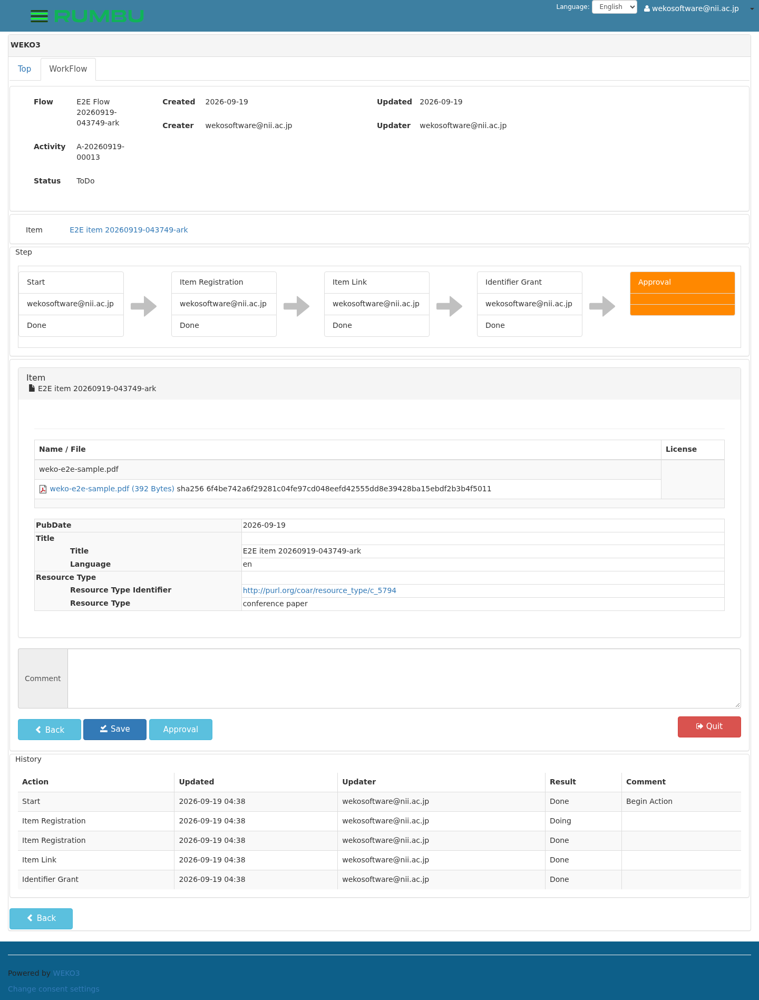
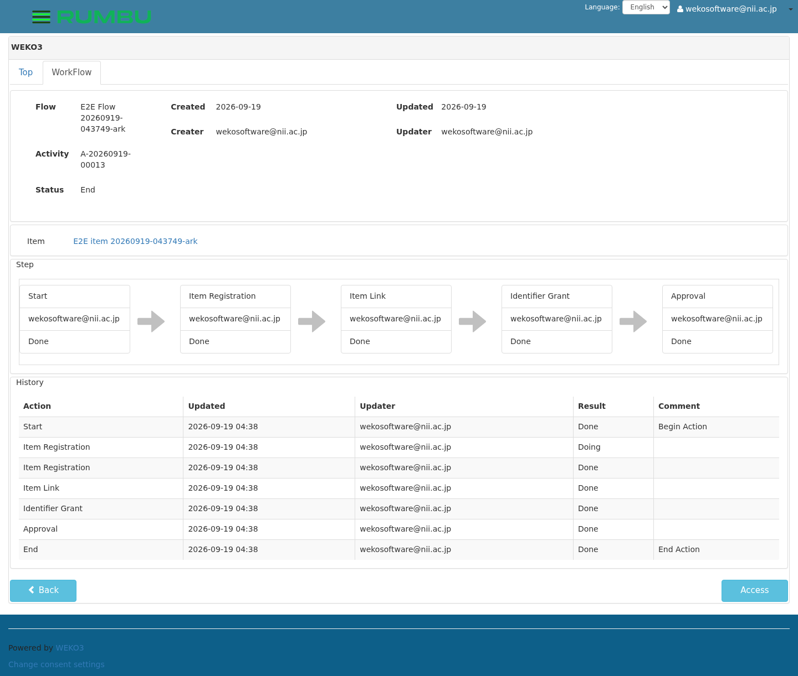
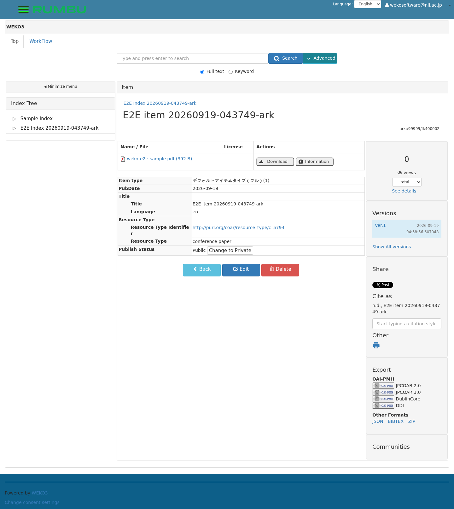

# E2E テスト実行記録: `ark` スイート

English: [`README.md`](README.md) ·
この記録が属する実行: [`../README.ja.md`](../README.ja.md)

ARK が発行され、アイテムのパーマリンクになることを確認します。WEKO は Item Registration の完了時に ARK
サーバを呼んで発行し、それは環境が ARK 用に設定されているときだけです。

テスト本体は [`../../tests/test_ark_mint.py`](../../tests/test_ark_mint.py)、画像は
[`images/`](images) にあり、 各ステップが実行中に自分で撮ったものです。

| | |
| --- | --- |
| 実行 ID | `20260919-043749` |
| 結果 | **6 passed** |
| 有効化 | `--suite ark`（`WEKO_E2E_ARK_NAAN=99999`） |

---

この環境には ARK サーバが無いため、代替スタブ（`e2ectl ark-stub enable`）に
対して実行しています。`e2ectl ark-account enable` で設定した実サーバに対する
実行結果は[実行記録の「別の環境設定での実行」](../README.ja.md#別の環境設定での実行)に
あります。

### DOI を付与せずにアイテムを登録（test_03）

ARK は Item Registration の完了時に発行されるため、画面上で ARK を要求する
操作はありません。

### アイテムが ARK を持つ（test_04 / test_05）

DOI も CNRI も無いアイテムのパーマリンクは ARK になります。ここでは
`ark:/99999/fk400002` で、設定した NAAN 配下であることも確認しています。

