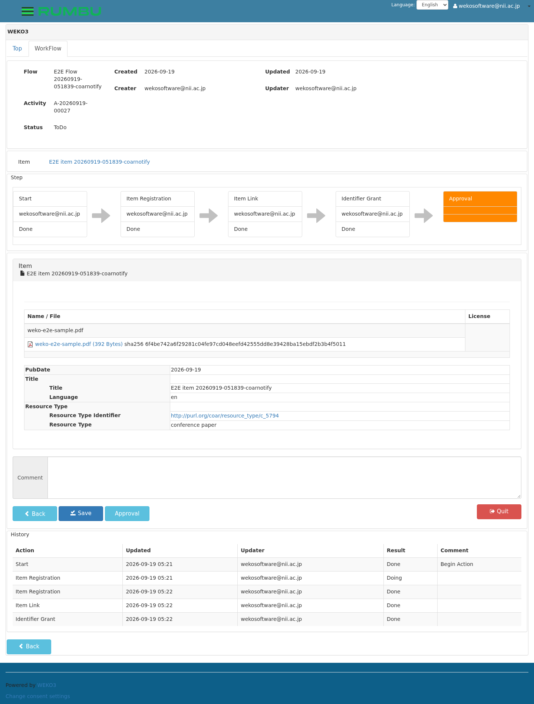
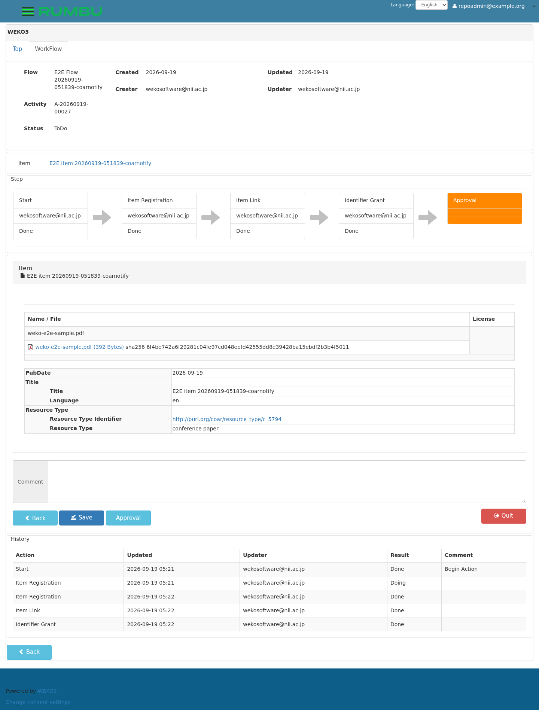
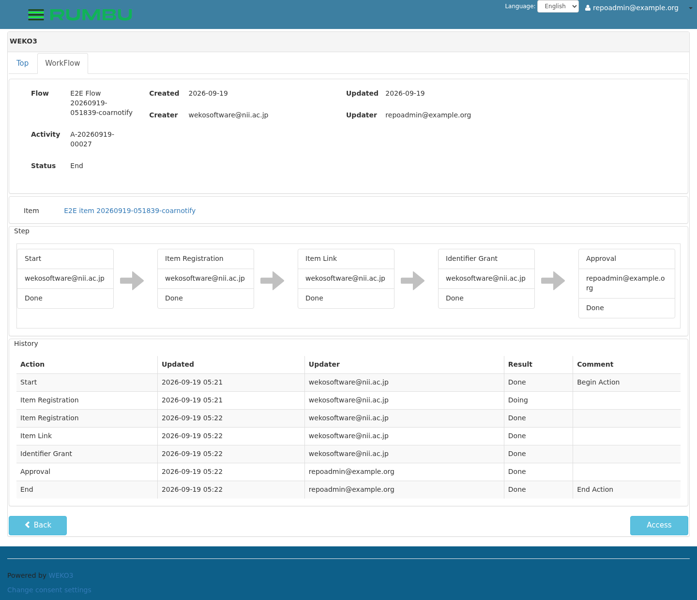
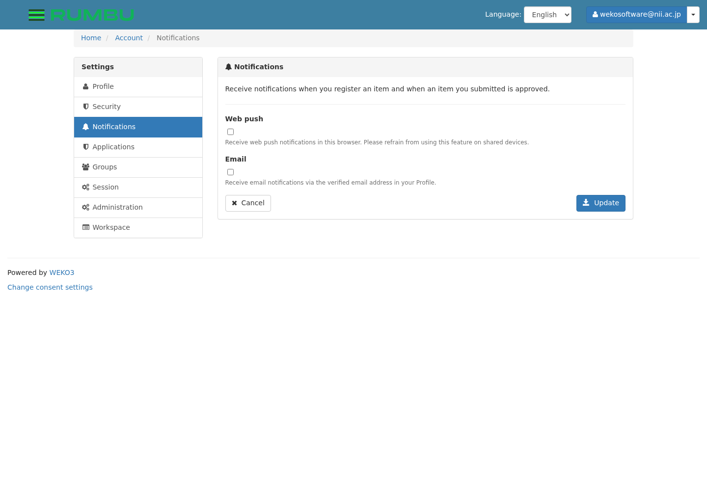

# E2E テスト実行記録: `coarnotify` スイート

English: [`README.md`](README.md) ·
この記録が属する実行: [`../README.ja.md`](../README.ja.md)

承認依頼と承認が COAR Notify で通知され、意図した相手に届き、さらにブラウザへ
Web Push で届くことを確認します。WEKO は「自分が行った操作の通知」から自分
自身を除外するため、2 アカウントが要ります。

テスト本体は
[`../../tests/test_coar_notify.py`](../../tests/test_coar_notify.py)、画像は
[`images/`](images) にあり、 各ステップが実行中に自分で撮ったものです。

| | |
| --- | --- |
| 実行 ID | `20260919-051839` |
| 結果 | **14 passed** |
| 有効化 | `--suite coarnotify`（Web Push の 4 ステップには `e2ectl webpush-stub enable`） |

---

WEKO はワークフローの出来事を COAR Notify のメッセージに変換し、この環境の
LDN Inbox（`inbox` コンテナ）へ POST します。受け取った通知は、宛先の利用者
に対して `GET /api/notifications` で返されます。

**誰に届くかが肝心です。** WEKO は「自分が行った操作の通知」から自分自身を
除外するため、このスイートは 2 アカウントを使います。登録は
`wekosoftware@nii.ac.jp`、承認は承認依頼の宛先であるリポジトリ管理者
`repoadmin@example.org` です。

### サイトが Inbox を広告している（test_02）

```console
$ curl -sI --insecure https://localhost/ | grep -i '^link:'
Link: <https://weko3.example.org/inbox>; rel="http://www.w3.org/ns/ldp#inbox"
```

この URL は `THEME_SITEURL`（インスタンスが自称する URL）から作られ、
テスト対象のアドレスとは限りません。そのためスイートは通知を URL そのもの
ではなく**パス**でテスト対象から取得します。またこのヘッダはトップページへの
HEAD にだけ付き GET には付かないので、ステップも HEAD で確認します。

未ログインの閲覧者に対しては、他人の通知ではなく 401 が返ります（test_03）。

### 承認者にアイテムが渡る（test_06 / test_07）

識別子付与から次へ進むとアクティビティが Approval に乗り、そこで WEKO が
承認者へ通知を送ります。



`repoadmin@example.org` として読み出し、Inbox から本体を取得したもの:

```json
{
  "id": "urn:uuid:5075cf1b-c765-49e7-ac3b-7e33d3848f1a",
  "@context": ["https://www.w3.org/ns/activitystreams", "https://coar-notify.net"],
  "type": ["Offer", "coar-notify:EndorsementAction"],
  "origin": {"id": "https://localhost/", "inbox": "…/inbox", "type": "Service"},
  "target": {"id": "https://weko3.example.org/users/2", "inbox": "…/inbox", "type": "Person"},
  "object": {"id": "https://localhost/records/2000066",
             "type": ["Page", "sorg:WebPage"],
             "name": "E2E item 20260919-051839-coarnotify"},
  "actor":  {"id": "https://weko3.example.org/users/1", "type": "Person"},
  "context": {"id": "https://localhost/workflow/activity/detail/A-20260919-00027",
              "type": ["Page", "sorg:WebPage"]}
}
```

通知とアクティビティを結び付けるのは `context` だけです。スイートは
「最後に届いたもの」ではなく、この `context` で自分の実行の通知を特定します。

### 承認者が承認する（test_10）

承認者は自分専用のブラウザコンテキストでアクティビティを開きます。WEKO は
アクティビティを「開いているウィンドウ」に対してロックするので、登録者が
先に画面から離れ（人が作業を引き継ぐときと同じ）、承認者は前の実行で掴んだ
ままのロックがあれば解放してから開きます。





### 承認が登録者に返る（test_11）

```
urn:uuid:77231c23-0b42-4712-adb4-078c9ac84950
  Announce+coar-notify:EndorsementAction
  -> https://weko3.example.org/users/1
  about 'E2E item 20260919-051839-coarnotify' (https://localhost/records/2000066)
```

`users/1` が登録者、`actor` は `users/2` = 依頼を受け取ったアカウントです。
ステップはまさにそこを確認します。依頼を受けた人が承認者として名乗られて
いること、そして承認した本人には通知が返っていないこと。

`./e2ectl inbox --run <実行 ID>` で往復の両端が見えます。

```console
$ ./e2ectl inbox --run 20260919-051839
registrant: wekosoftware@nii.ac.jp
  announced inbox: https://weko3.example.org/inbox
  2026-09-19 05:22:28  … Announce+…EndorsementAction -> …/users/1 about 'E2E item 20260919-051839-coarnotify'
  2026-09-19 05:22:28  … Announce+…EndorsementAction -> …/users/1 about 'E2E item 20260919-051839-coarnotify'
  2 of 2 notification(s) shown
approver: repoadmin@example.org
  2026-09-19 05:22:11  … Offer+…EndorsementAction -> …/users/2 about 'E2E item 20260919-051839-coarnotify'
  2026-09-19 05:23:57  … Offer+…EndorsementAction -> …/users/2 about 'E2E item 20260919-051839-crossref'
  2026-09-19 05:19:31  … Offer+…EndorsementAction -> …/users/2 about 'E2E item 20260919-051839-ark'
  2026-09-19 05:20:56  … Offer+…EndorsementAction -> …/users/2 about 'E2E item 20260919-051839'
  4 of 40 notification(s) shown
```

承認依頼が 4 件あるのは、アイテムを登録する**すべての**スイート（基本と
識別子系 2 つを含む）がそれぞれ 1 件送るためです。承認通知が `coarnotify`
スイートのものだけなのは、登録者以外に承認させるのがこのスイートだけだから
です。登録者側の 2 件目は、購読解除後に Push が飛ばないことを確かめるために
ステップ 13 が Inbox へ投げた複製です。

---

## Web Push

通知は Web Push で利用者に届けることもできます。WEKO の担当は購読・ユーザー
プロファイル・メッセージテンプレートを Inbox に登録するところまでで、通知を
購読鍵で暗号化して配送するのは Inbox です。

これを実際に試すには障害が 2 つあり、`e2ectl webpush-stub enable` が両方を
片付けます。本物の購読はブラウザの Push サービスから取るものでローカル環境
からは到達できず、配布時の compose ファイルは Inbox の VAPID 鍵を空にして
いるため、そもそも署名ができません。

### 署名でき、受け取る相手もいる（test_08）

```console
$ curl -sk https://localhost/inbox/subscription/vapid-public-key
BNu4cf2G6F9kcCKY...

$ ./e2ectl webpush-stub status
settings in docker-compose2.yml: present
stand-in in the container: subscribed as http://127.0.0.1:8901/push
pushes received so far: 0
```

代替は `weko_e2e/pushstub.py` で、Inbox が送信元とする `inbox` コンテナの
ループバックで動きます。購読鍵を自前で持つので、ネットワーク越しに到達可能な
ものも、どこかの Push サービスのアカウントも不要です。

### 登録者が購読する（test_09）

代替は自分の購読と `https://weko3.example.org/users/1` のユーザープロファイル
を登録します。これは本物のブラウザが購読したときに通知設定画面が送るものと
同じです。プロファイルは省略できません。Inbox はこれでメッセージの言語を
決めるためです。

### 承認が Web Push で届く（test_12）

ペイロードは購読鍵で暗号化されているので、代替が復号したものがそのまま
ブラウザに表示されたはずの内容です。

```json
{
  "title": "Your item is now approved",
  "options": {
    "body": "\"E2E item 20260919-051839-coarnotify\" has been approved by Unknown.",
    "tag": "urn:uuid:77231c23-0b42-4712-adb4-078c9ac84950",
    "icon": "/static/images/weko-logo-256.png",
    "badge": "/static/images/weko-logo-256.png",
    "requireInteraction": false,
    "data": {"url": "https://localhost/workflow/activity/detail/A-20260919-00027"}
  }
}
```

この文面はテスト側には書かれていません。WEKO チェックアウトの `push.json` を
読み、Inbox と同じ展開をして比較します。つまり文面はその環境自身のもので、
テンプレートを変更したのに登録し直していない場合はここで露見します。

`tag` はどの通知についての Push かを示し、実行が自分のものを見つける手掛かり
です。`data.url` はアクティビティで、Push をクリックした利用者が開く先です。

**"approved by Unknown"** は実行の不具合ではなく WEKO の仕様です。承認者の
ユーザープロファイル行が無く、`Notification.set_all` の
`actor_name or "Unknown"` に落ちています。通知側も同じ値なので、通知と Push
を突き合わせるこのステップは一致します。

### 購読解除すると届かなくなる（test_13）

1 回の実行で承認は 1 回しか行えないので、2 通目は送信者がするのと同じ手順、
つまり `/inbox` への POST で Inbox へ渡します。id 以外は同じ通知です。
これに対して Push は飛びませんでした。変わったのは購読の有無だけです。

### 通知方法の設定画面（test_14）



利用者ごとに Web push と Email を選べ、Web push スイッチの裏にある Service
Worker（`/static/gen/sw.js`）も配信されています。実際にスイッチを入れるには
ブラウザの通知許可と Push サービスが要りますが、そこを肩代わりするのが上記の
代替です。
