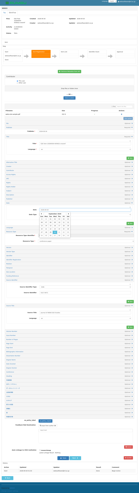
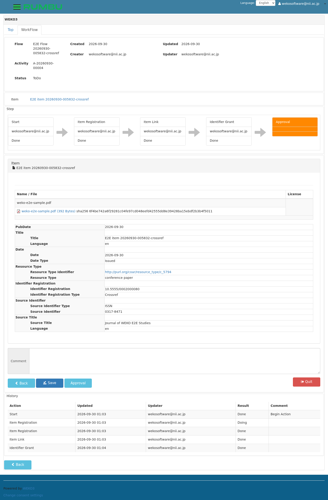
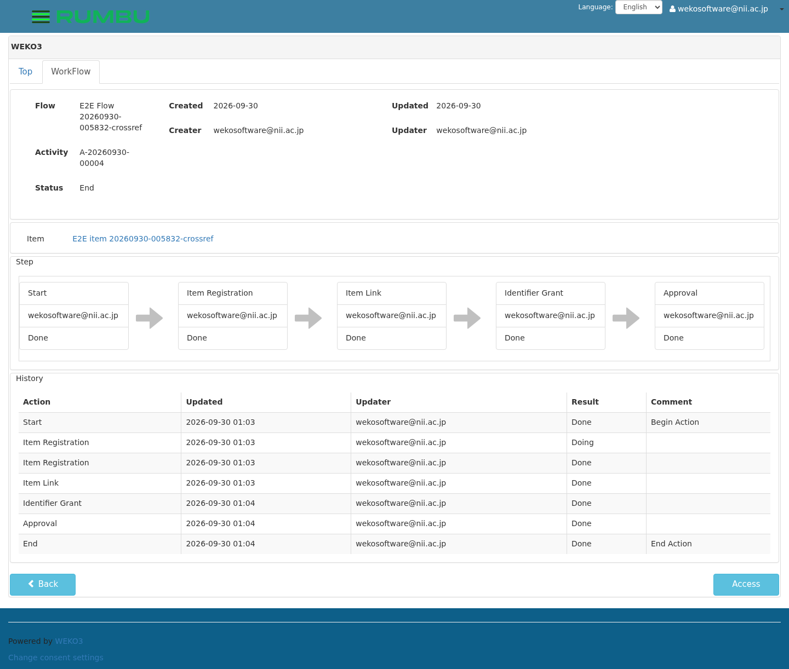
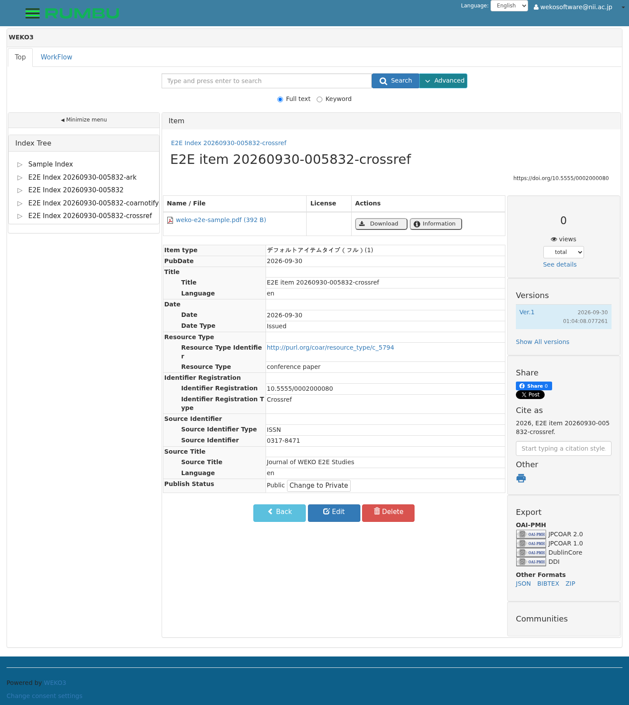

# E2E test run report: the `crossref` suite

日本語版: [`README.ja.md`](README.ja.md) ·
the run this belongs to: [`../README.md`](../README.md)

A Crossref DOI is granted to the item and becomes its permalink. Depositing
it to Crossref is a step further, and needs an account this instance was not
given.

The suite is
[`../../tests/test_crossref_doi.py`](../../tests/test_crossref_doi.py); the
screenshots below are in [`images/`](images), taken by the steps themselves
as they went.

| | |
| --- | --- |
| Run id | `20260930-005832` |
| Result | **8 passed, 2 skipped** |
| Asked for with | `--suite crossref` |

---

### The prefix is configured (test_01)

The suite turns the Crossref grant on and sets the prefix, and puts both
back the way it found them when it is done.


### The metadata a deposit needs (test_03)

Crossref will not take a journal article without the journal, its ISSN
and the date it was issued, so the suite fills those in where the base
flow does not.



### The Crossref grant is offered, and taken (test_04)


### Approve, and read the DOI (test_05 to test_08)





The item carries `10.5555/0002000080`, under the prefix the suite
configured, and shows it as its permalink.



### The deposit (test_09, test_10)

Skipped here, for want of an account. Verified separately against a
stand-in for Crossref, which is what showed the whole path works:

```
granted DOI: 10.5555/0002000032
deposit: {'id': 1, 'agency': 'Crossref', 'status': 'submitted', 'attempt': 1,
          'poll': 0, 'http': 200, 'tracking_id': 'weko-82309c1d…-20260917222135'}
deposit: {'id': 1, 'agency': 'Crossref', 'status': 'success', 'attempt': 1,
          'poll': 1, 'http': 200, 'error': 'Crossref registered the DOI.'}
→ 10 passed
```

With `WEKO_E2E_CROSSREF_DEPOSIT` set and an account written into the
instance by `e2ectl crossref-account enable`, those two steps wait for
the worker to deposit and report what Crossref said.
