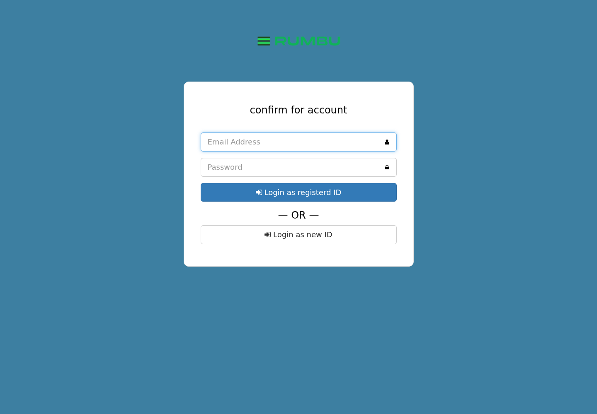
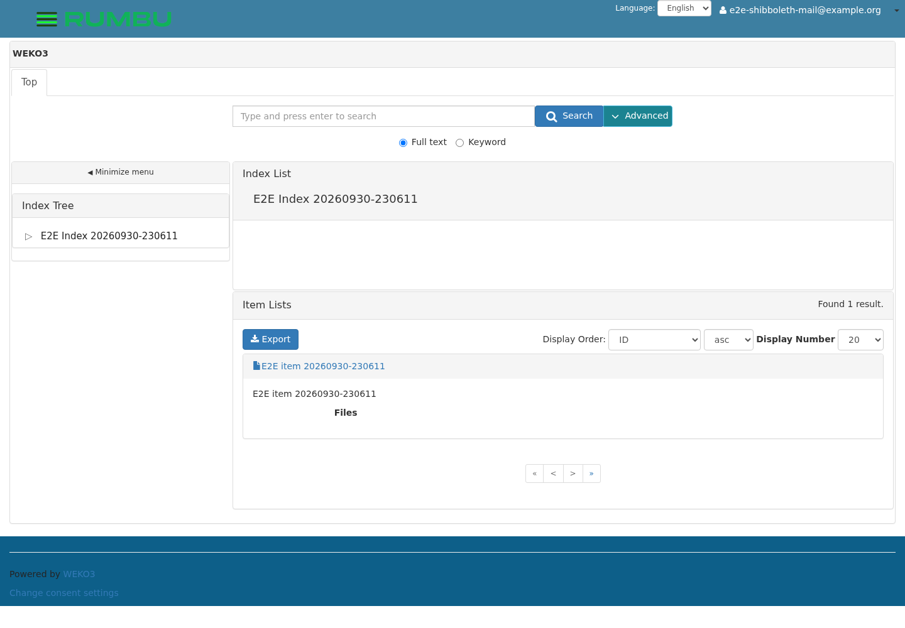
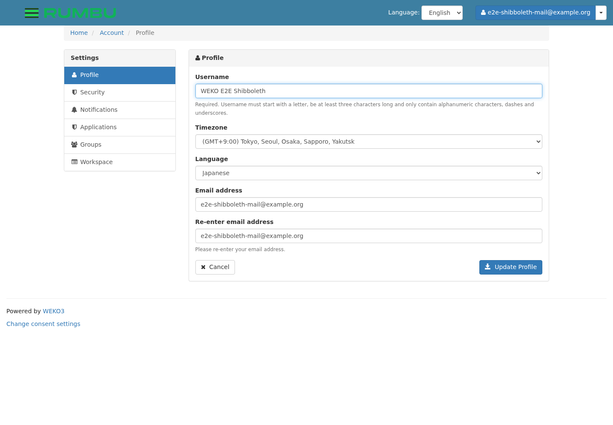

# E2E test run report: the `shibboleth` suite

日本語版: [`README.ja.md`](README.ja.md) ·
the run this belongs to: [`../README.md`](../README.md)

A Shibboleth user logs in, and the account WEKO gives them is made out of
`mail` — not out of `eppn`. No IdP is involved, and no account that was
already on the instance is touched.

The suite is
[`../../tests/test_shibboleth.py`](../../tests/test_shibboleth.py); the
screenshots below are in [`images/`](images), taken by the steps themselves
as they went.

| | |
| --- | --- |
| Run id | `20260930-234316` |
| Result | **9 passed** |
| Asked for with | `--suite shibboleth` |

---

## Why there is no IdP here

WEKO is not what speaks SAML. The Service Provider does, in nginx, and what
reaches WEKO is an ordinary POST of the attributes the IdP released —
`nginx/login.py` is the script that makes it:

```python
# nginx/login.py, in the nginx container
base_url = os.environ['REQUEST_SCHEME'] + '://' + os.environ['HTTP_HOST']
requests.post(base_url + '/weko/shib/login?next=' + next_url, data=attrs)
```

So the suite needs no IdP. `weko_e2e/shibstub.py` is copied into the
**nginx** container and sends what that script sends, from where it sends
it.

**Where the POST comes from is the point.** `release_v2.1.0` closes
`POST /weko/shib/login` to everything but the addresses in
`WEKO_ACCOUNTS_SHIB_SP_ALLOWED_ADDRS`:

```python
@shib_sp_source_required
def shib_sp_login():
    ...
```

Standing where the SP stands is how this suite stays on the right side of
that check. **Nothing in it widens the list**, and nothing should: an
instance that takes those attributes from anywhere is an instance anyone
can log into as anyone.

### What the stand-in sends (test_01, test_03)

```console
$ ./e2ectl shib login
posted as e2e-shibboleth@example.org (mail e2e-shibboleth-mail@example.org)
WEKO answered 200
follow /weko/shib/login?Shib-Session-ID=_4262e5a1fb8c41cba73d67b5fa16d44e&next=%2F to take the session
```

The `eppn` and the `mail` are **deliberately different**, which is what lets
the run say which one WEKO used rather than agree with either.

WEKO answers a path rather than a redirect — the SP's script is what turns
it into one — and the session is made by whoever *follows* it. An identity
WEKO has not seen is sent to the confirmation screen, which is what the step
checks.

---

## The two ways through, and why only one is taken (test_04)



| | |
| --- | --- |
| **Login as new ID** | makes an account out of the attributes |
| **Login as registerd ID** | binds to an account you name **and overwrites that account's email** |

The second is not a hypothetical:

```python
# weko_accounts/api.py, ShibUser.bind_relation_info
with db.session.begin_nested():
    self.user.email = self.shib_attr['shib_mail']
```

Bind `wekosoftware@nii.ac.jp` to a Shibboleth identity and that account is
afterwards called whatever the IdP released — and nobody can log in as it
through the login screen any more. So the suite takes the new-user way, and
the step only checks that both are offered.

### A new user comes out the other side logged in (test_05)



---

## Which attribute became the account (test_06, test_07)

```console
$ psql -c "SELECT s.shib_eppn, u.email FROM shibboleth_user s
           JOIN accounts_user u ON u.id = s.weko_uid"
     e2e-shibboleth@example.org | e2e-shibboleth-mail@example.org
```

`eppn` became the binding; `mail` became the account. Read back from the
profile screen — the one screen that shows a user their own account and
nothing else:



The `eppn` appears nowhere on it. `Username` is the `DisplayName` the IdP
released, and `Email address` is the `mail`.

**This is the thing worth testing.** An IdP that releases an `eppn` and no
`mail`, or a `mail` that is not the address the repository knows the person
by, gives them an account under a name nobody expects — and the repository
has no screen that would show that going wrong.

### A known identity comes straight in (test_08)

The second login gets `/weko/auto/login` instead of the confirmation screen:
WEKO found the binding and had nothing to ask.

### A session id nobody issued buys nothing (test_09)

The path the SP sends a user to carries the session id in the URL, which is
only safe because the id has to have been cached by a POST WEKO accepted —
and that POST is what the address check guards. The step asks for a made-up
one and checks that what comes back is still a visitor.

---

## What the run left behind

Nothing.

```console
$ ./e2ectl shib status
shibboleth login: off
e2e-shibboleth@example.org: nothing bound
```

The suite turns Shibboleth login on at `/admin/shibboleth/` itself and puts
the switch back to what it was, and the account it made is removed on the
way out — pass or fail, because both happen in the fixture's teardown.

The switch is saved together with the default roles, the attribute mapping
and the blocked users, and the screen builds those three in the browser
rather than in the page. A save that sends only the switch therefore reaches
WEKO with the rest empty and **blanks them**; `shib_login_enabled()` sends
every one of them back exactly as the screen is holding it, and changes only
the switch.
