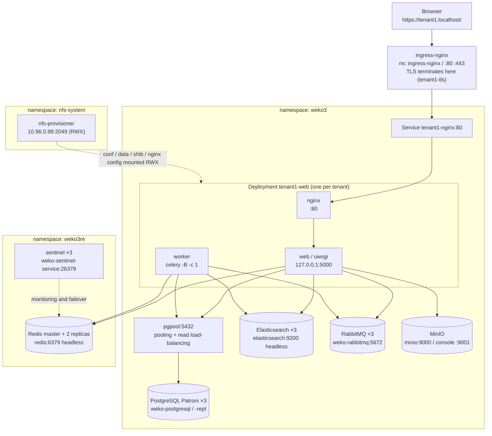
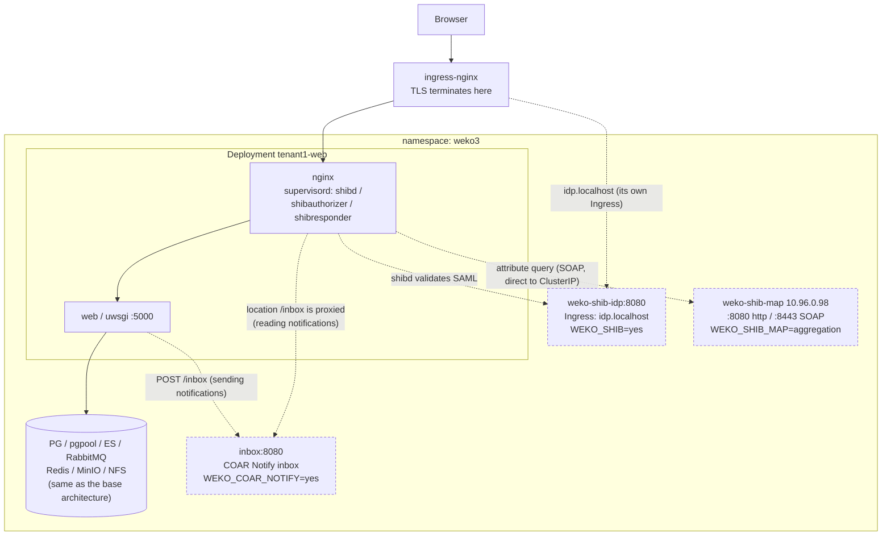
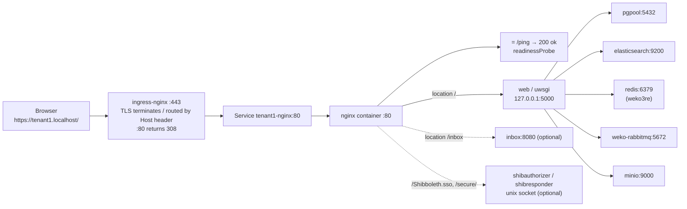
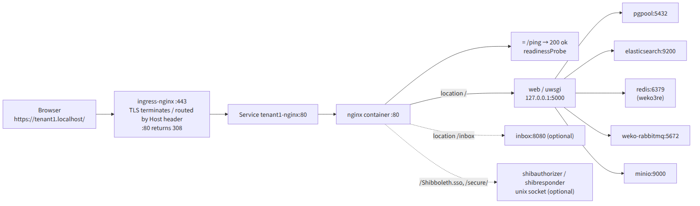
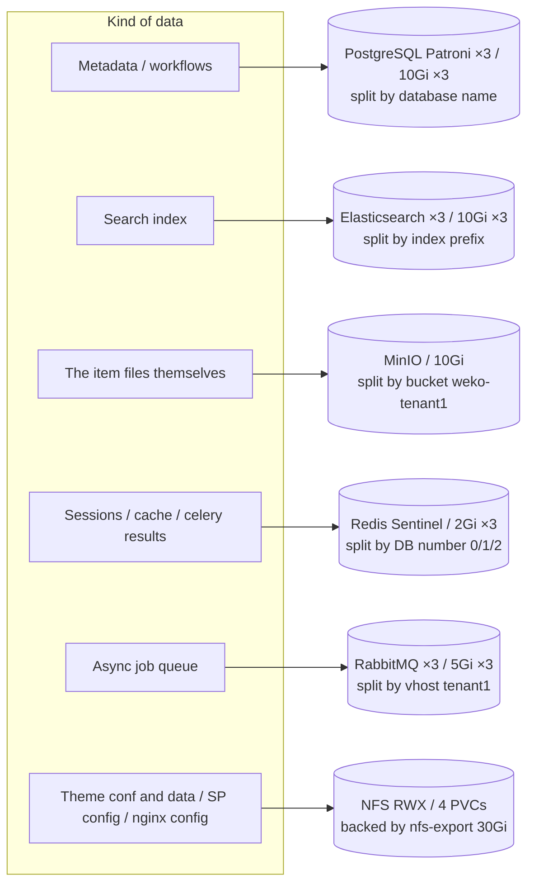
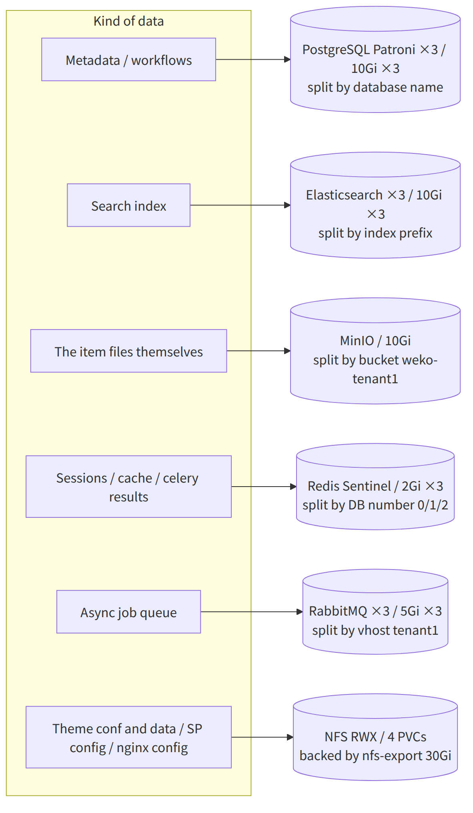

# k8s-weko (arm64) — WEKO3 on kind (arm64 native)

Manifests and scripts that build a production-like **JAIRO Cloud** environment, based on **WEKO3**, on a
single arm64 Linux host using **kind** (Kubernetes-in-Docker). Everything is **arm64 native** and no
external registry is needed: every image, pgpool included, is built locally from source and loaded
straight into the kind nodes.

Target host: **arm64 (aarch64) Linux / 64 GB RAM or more / plenty of free disk** (the reference machine
has 20 cores and 121 GB RAM).

> One run of `deploy-arm64.sh` builds the full current configuration: **HA clusters (PG Patroni ×3 /
> RabbitMQ ×3 / ES ×3) + pgpool + Redis Sentinel + persistence (PVC) + NFS (RWX) + an S3 (MinIO) file
> Location + multi-tenancy**.
> (This is the arm64 counterpart of `k8s-weko-amd64/`. The main differences are that everything is
> arm64 native, the backends run three nodes each, and pgpool is built from source because there is no
> official arm64 pgpool image.)

## Table of contents
**Shortest path**: [Before you start](#before-you-start-installing-the-tools) →
[edit tenants.txt](#edit-tenantstxt-before-deploying) → [Deploy](#deploy) →
open `https://tenant1.localhost/`

| Section | Contents |
|---|---|
| [What this set uses](#what-this-set-uses) / [Files in this set](#files-in-this-set-ship-these-with-this-readme) | What gets built and deployed, and what ships here |
| [Before you start](#before-you-start-installing-the-tools) | Tool check and installation. **Start with `check-prereq-arm64.sh`** |
| [Deploy](#deploy) | `bash deploy-arm64.sh`, the breakdown of steps 0-9, [turning every optional feature on](#enabling-every-optional-feature), [users that get created](#users-that-get-created-important) |
| [System architecture after deploy](#system-architecture-after-deploy) | Overall picture, optional features, request path, and where the data lives (mermaid) |
| [Building a specific version](#building-a-specific-version-tag) | Pin a release with `WEKO_TAG` |
| [Using different images](#using-different-weko--pgpool-images) | Prebuilt images; the full environment-variable list is here |
| [HTTPS certificates](#https-certificates) | Automatic issuance by default; bring your own or use Let's Encrypt |
| [Shibboleth login](#shibboleth-login-optional) | `WEKO_SHIB=yes` stands up an in-cluster IdP to exercise the GakuNin-equivalent path |
| [Day-to-day operation and teardown](#day-to-day-operation-and-teardown) | Delete with **`teardown-arm64.sh`**; stop without deleting in [Suspending and resuming](#suspending-and-resuming-stopping-without-losing-the-data); partial rollback in [UNDEPLOY-arm64.en.md](./UNDEPLOY-arm64.en.md) |
| [How to change the size](#how-to-change-the-size) / [If something goes wrong](#if-something-goes-wrong) | Scaling up or down, and fixing failures |

> **When in trouble**: read the **first item** of the troubleshooting section (ARP collision caused by
> an orphaned veth). When several unrelated-looking things fail at once, that single cause is often
> behind all of them.

## What this set uses
| Item | Setting |
|---|---|
| WEKO application | `weko3-web:arm64` (arm64-native build from the latest source) |
| Front proxy | `weko3-nginx:arm64` (in front of uwsgi, with the Shibboleth SP; built from source) |
| Elasticsearch | `weko-elasticsearch:6.8.23-arm64` (built from source), 3 nodes, configured with `-E` arguments |
| PostgreSQL | Patroni, 3 nodes (Zalando postgres-operator, spilo-17 = PG17, synchronous replication) |
| pgpool | `weko-pgpool:4.2.2-arm64` (built from source) in front of PostgreSQL (pooling + read load-balancing) |
| RabbitMQ | 3-node cluster (RabbitMQ Cluster Operator, rabbitmq:4.0.9) |
| Redis | Sentinel (master + 2 replicas + 3 sentinels) |
| File storage | An S3 Location on **MinIO** (uploads go to a per-tenant bucket through s3fs) |
| Shared FS | NFS (RWX), used only for the theme conf/data and the Shibboleth SP configuration |
| Emulation (binfmt) | Not needed (arm64 native) |

## Files in this set (ship these with this README)
The deploy reads the files below. Run `deploy-arm64.sh` from this directory; the kind config lives one
level up.

| Kind | Files |
|---|---|
| Entry point | `deploy-arm64.sh` (runs steps 0-9 in one go) |
| Pre-flight check | `check-prereq-arm64.sh` (decides what to install; no root, changes nothing) |
| Deletion | `teardown-arm64.sh` (waits for the Pods, then deletes the cluster; never call `kind delete` directly) |
| Recovery | `unwedge-arm64.sh` (recovers nodes that an NFS hang made undeletable; needs root)<br>`UNDEPLOY-arm64.en.md` (step-by-step undeploy and failed-deletion recovery) |
| Host setup | `prereq-arm64.sh` (Docker / kubectl / kind / sysctl / weko source; needs root) |
| Cluster | `../kind-weko-cluster.yaml` (repository root; 3 nodes: control-plane + WEKO + DATA; shared with amd64) |
| Backends (YAML) | `00-namespace.yaml` `13-elasticsearch.yaml` `21-nginx-config.yaml` `40-minio.yaml` `41-redis-sentinel.yaml` `50-rabbitmq-cluster.yaml` `51-postgresql-ha.yaml` `52-postgres-pod-config.yaml` `60-nfs-server.yaml` `62-pgpool.yaml` |
| HTTPS (optional) | `61-tls-ca.yaml` (the cert-manager root CA; deployed by the default `WEKO_TLS_ISSUER=weko-ca-issuer`)<br>`HTTPS-letsencrypt.en.md` (switching to Let's Encrypt on a public domain) |
| Shibboleth (optional) | `70-shibboleth-idp.yaml` `71-shibboleth-map.yaml` (a test IdP and the mAP-equivalent attribute authority)<br>`shib-idp-build/` (the IdP image: official tarball + Tomcat 10.1)<br>`shib-sp-template/` `provision-shib.sh` `check-shib-login.py` `list-shib-users.py`<br>`SHIBBOLETH-IDP.en.md` (how to enable it with `WEKO_SHIB=yes`) |
| COAR Notify (optional) | `72-coar-notify-inbox.yaml` (the LDN inbox)<br>`coar-notify-inbox/inbox.py` (the inbox itself; Python standard library only)<br>`COAR-NOTIFY.en.md` (how to enable it with `WEKO_COAR_NOTIFY=yes`) |
| pgpool image build | `pgpool-build/` (`Dockerfile.arm64` + `entrypoint.sh` + `start.sh`; produces `weko-pgpool:4.2.2-arm64`) |
| Getting in | `ACCESS-kubectl.en.md` (kubectl commands for PostgreSQL / ES / Redis / RabbitMQ / MinIO / WEKO / the IdP) |
| Tenant tooling | `gen-tenant.sh` `provision-nfs.sh` `provision-tenants.sh` `weko-init.sh` `seed-demo.sh` `set-s3-location.sh` |
| Configuration | `tenants.txt` (tenant definitions; edit the administrator address and password here) |
| Diagrams | `images/` (PNG versions of [the architecture diagrams](#system-architecture-after-deploy), for viewers that do not render mermaid)<br>`images/README.md` (how to regenerate them) |

> `10-postgresql.yaml` / `11-redis.yaml` / `12-rabbitmq.yaml` / `20-weko-config.yaml` / `30-weko-web.yaml` /
> `Dockerfile.es` belong to the single-tenant tutorial in §1-9 of `README.md`. The full deploy
> (`deploy-arm64.sh`) does not use them.

Created at run time (no need to ship): `generated/` (the per-tenant manifests) and `.secret-seed`
(the seed for the application secret keys, created on the first run; keep it to keep the keys stable).

## Before you start (installing the tools)

Requirements: **arm64 Linux / 64 GB RAM or more / plenty of free disk**. `sudo bash prereq-arm64.sh`
does everything at once (Docker / kubectl / kind / kernel settings / fetching the weko source; needs
root). To do it by hand, see below. Docker and the kernel settings need root; if you have no sudo, ask
an administrator to run (a) and (c).

**Nothing has to be reinstalled on a machine that already has the tools.** Run the check below and only
act on the items marked `→`.

### The check (run this first)
Reports OK / needs-install / needs-update for each tool, the environment and the kernel settings.
No root, changes nothing.
```bash
bash check-prereq-arm64.sh
```
Example output:
```
== tools ==
  TOOL                 CURRENT    REQUIRED               VERDICT
  docker               29.1.3     20.10+ and buildx      OK
  kubectl              1.36.3     1.33-1.35 (node 1.34)  △ 2 minors from node 1.34; works but unsupported
  kind                 0.30.0     0.30.0+                OK
  git                  2.43.0     any                    OK

== environment ==
  arch                 aarch64    aarch64                OK
  RAM                  121Gi      64Gi+                  OK
  disk-free            309Gi      100Gi+                 OK
  docker-group         yes        docker without sudo    OK

== kernel (sysctl) ==
  vm.max_map_count     262144     262144+                OK
  ...
```
Exit status: 0 = all OK, 1 = action needed (`→`), 2 = warnings only (`△`).

How to read the verdicts:

| Verdict | Meaning | Action |
|---|---|---|
| `OK` | The requirement is met | **Do nothing** (do not reinstall) |
| `→ install with ...` | Not installed | Run the referenced section |
| `→ update with ...` | Too old to be reliable | Run the referenced section to replace it |
| `△` | Works, but outside the recommended range | Not urgent; read the reasoning below and decide |

**Why these versions**:
- **docker 20.10+ / buildx** — the image builds use BuildKit.
- **kubectl 1.33-1.35** — kind v0.30.0's default node image is `kindest/node:v1.34.0`, and kubectl is
  officially supported only **within one minor** of the API server. Replace it with (b) if you get `△`.
- **kind 0.30.0+** — older versions cannot handle `kindest/node:v1.34.0`.
- **64 GiB RAM / 100 GiB free** — measured with ES ×3, PG ×3, RabbitMQ ×3 and the image builds. Below
  that you have to reduce the tenant count or lower the ES heap (see [How to change the size](#how-to-change-the-size)).

Only run the (a)-(d) sections flagged with `→`.

### (a) Docker (arm64)
Use this to install, and also when the check says `→ update with (a)`.
```bash
# Ubuntu/Debian
sudo apt-get update && sudo apt-get install -y ca-certificates curl gnupg
sudo install -m0755 -d /etc/apt/keyrings
curl -fsSL https://download.docker.com/linux/ubuntu/gpg | sudo gpg --dearmor -o /etc/apt/keyrings/docker.gpg
echo "deb [arch=arm64 signed-by=/etc/apt/keyrings/docker.gpg] https://download.docker.com/linux/ubuntu $(. /etc/os-release; echo $VERSION_CODENAME) stable" | sudo tee /etc/apt/sources.list.d/docker.list
sudo apt-get update && sudo apt-get install -y docker-ce docker-ce-cli containerd.io docker-buildx-plugin

# RHEL/Rocky/AlmaLinux
sudo dnf install -y dnf-plugins-core
sudo dnf config-manager --add-repo https://download.docker.com/linux/centos/docker-ce.repo
sudo dnf install -y docker-ce docker-ce-cli containerd.io docker-buildx-plugin

sudo systemctl enable --now docker
sudo usermod -aG docker "$USER"   # re-login (or newgrp docker) for this to take effect
```

### (b) kubectl / kind (arm64 binaries)
Installing and updating are **the same procedure** (the binary is overwritten). Run whichever you need.
No sudo, because they go into `~/.local/bin`.
```bash
mkdir -p ~/.local/bin
# Pin kubectl to the 1.34 line, matching the node image (kindest/node:v1.34.0). Only the minor is
# pinned; the patch level still follows the latest release. Using stable.txt (whatever is newest)
# drifts away from the node and leaves kubectl's supported skew of +/-1 minor against the API server.
KVER=$(curl -sL https://dl.k8s.io/release/stable-1.34.txt)
curl -sLo ~/.local/bin/kubectl "https://dl.k8s.io/release/${KVER}/bin/linux/arm64/kubectl"
curl -sLo ~/.local/bin/kind    "https://kind.sigs.k8s.io/dl/v0.30.0/kind-linux-arm64"
chmod +x ~/.local/bin/kubectl ~/.local/bin/kind
echo 'export PATH=$HOME/.local/bin:$PATH' >> ~/.bashrc; export PATH=$HOME/.local/bin:$PATH
kubectl version --client; kind version
```
> If an older kubectl / kind also exists elsewhere (`/usr/local/bin` and friends), PATH decides which
> one wins. If the verdict does not change after an update, check with `which -a kubectl kind`.

### (c) Kernel parameters (required by ES and by running many Pods)
Not needed if all three items are `OK`. Run it if any of them shows `→` (the settings survive reboots).
```bash
sudo tee /etc/sysctl.d/99-weko.conf >/dev/null <<'EOF'
vm.max_map_count=262144
fs.inotify.max_user_watches=1048576
fs.inotify.max_user_instances=8192
EOF
sudo sysctl --system
```
> ES does not start when `vm.max_map_count` is too small. Low inotify limits cause
> "too many open files" once many Pods are running.

### (d) Get the weko source (needed to build the weko / nginx / ES images)
```bash
git clone https://github.com/RCOSDP/weko.git "$HOME/weko"
```
> Step 0 of `deploy-arm64.sh` clones/pulls this automatically, so you do not have to do it first.
> The default location is `$HOME/weko`; set `WEKO_SRC` only if you keep it elsewhere.
> The pgpool image does not come from the weko source but from `pgpool-build/` in this directory.

Once you are done, re-run `bash check-prereq-arm64.sh` and confirm every item reports `OK`.

### Edit `tenants.txt` before deploying
Put a real administrator address in it and **change the default password** for every tenant. Columns:
`NAME  DBNAME  HOST  ADMIN_EMAIL  ADMIN_PASS  INIT  CACHE_DB SESSION_DB CELERY_DB`.
A from-scratch build initializes every tenant (`FORCE_INIT=yes` by default, which overrides an `INIT`
column of `no`).

```bash
$EDITOR tenants.txt
```

Only the single `tenant1` line is active by default. At a minimum, replace `ADMIN_EMAIL` and `ADMIN_PASS`:

```
# the default (do not deploy this as it is)
tenant1  wekodb   tenant1.localhost  admin@example.org  adminpass123  no  0 1 2
# after editing (example)
tenant1  wekodb   tenant1.localhost  admin@example.jp   <a password of your own>  no  0 1 2
```

- To add a tenant, uncomment the `tenant2` line (or add one in the same format). `NAME`, `DBNAME`, `HOST` and
  the three Redis DB numbers **must not be shared between tenants**, and `3` and `4` are reserved, so avoid them.
- A `HOST` under `*.localhost` resolves to the loopback address, so no `/etc/hosts` entry is needed. A domain
  of your own needs name resolution and routing arranged separately.
- If you deployed before editing the file, disable the unwanted users as described in
  [Users that get created](#users-that-get-created-important) and change the password from the admin screen.

> `ADMIN_PASS` is not only the administrator's password: **the four test users created during
> initialization get the same value**. See [Users that get created](#users-that-get-created-important).

## Deploy
**Edit `tenants.txt` before running this.** Otherwise the environment is deployed with the default
administrator address and password, and changing them afterwards means touching the database
(→ [Edit `tenants.txt` before deploying](#edit-tenantstxt-before-deploying)).

```bash
cd k8s-weko                          # this directory
$EDITOR tenants.txt                  # change the administrator address/password; add a line per extra tenant
bash deploy-arm64.sh
# Runs step 1 (cluster) through step 9 (connectivity) in one go, including the arm64 builds of
# weko / ES / nginx / pgpool. Tenant initialization runs in parallel and takes tens of minutes.
# The weko source is fetched into $HOME/weko by default.
# Source elsewhere:                    WEKO_SRC=/opt/weko bash deploy-arm64.sh
# Re-run on an existing cluster and honour the INIT column: FORCE_INIT=no bash deploy-arm64.sh
# No HTTPS (back to the ingress built-in self-signed cert): WEKO_TLS_ISSUER= bash deploy-arm64.sh
```
### Enabling every optional feature

There are four features that default to `no`. Turning all of them on looks like this:

```bash
WEKO_SHIB=yes \
WEKO_SHIB_MAP=aggregation \
WEKO_SHIB_LOGIN_ONLY=yes \
WEKO_COAR_NOTIFY=yes \
bash deploy-arm64.sh
```

| Variable | What it adds |
|---|---|
| `WEKO_SHIB=yes` | A Shibboleth IdP inside the cluster (`idp.localhost`) - the GakuNin-equivalent SAML login path |
| `WEKO_SHIB_MAP=aggregation` | The mAP-equivalent attribute authority (`map.localhost`); the SP fetches `isMemberOf` over SimpleAggregation and the groups become WEKO roles |
| `WEKO_SHIB_LOGIN_ONLY=yes` | Sends `/login` itself straight to the IdP (Shibboleth-only login) |
| `WEKO_COAR_NOTIFY=yes` | The COAR Notify inbox (the `inbox` Service) and the tenant's `/inbox` relay |

The endpoints this adds:

| URL | Contents |
|---|---|
| `https://<tenant>.localhost/weko/shib/sp/login` | The Shibboleth login entry point |
| `https://idp.localhost/idp/status` | IdP health (200 means the configuration loaded) |
| `https://<tenant>.localhost/inbox` | The COAR Notify notifications received |

> **`WEKO_SHIB_LOGIN_ONLY=yes` has a real side effect.** The local login form disappears from
> `/login`, so **stopping the IdP locks you out of the browser entirely** - including the
> administrator from `tenants.txt`. If the IdP may go down during testing, leave this one out and
> start with the other three:
>
> ```bash
> WEKO_SHIB=yes WEKO_SHIB_MAP=aggregation WEKO_COAR_NOTIFY=yes bash deploy-arm64.sh
> ```
>
> That combination is verified on a running cluster. See [SHIBBOLETH-IDP.en.md](./SHIBBOLETH-IDP.en.md)
> and [COAR-NOTIFY.en.md](./COAR-NOTIFY.en.md) for the details.

> **`WEKO_NGINX_SHIB` is deliberately absent.** It is the mode that uses production's `weko.conf`
> verbatim and is mutually exclusive with `WEKO_SHIB`; setting both to `yes` simply lets `WEKO_SHIB`
> win, with a warning.
>
> **The build takes longer.** Building the IdP and attribute authority images adds several to
> fifteen minutes on the first run; later runs hit the Docker cache.

What `deploy-arm64.sh` does:
0. **Fetch/update the weko source** (`git clone` / `git pull`; controlled by `WEKO_REPO` / `WEKO_BRANCH` / `WEKO_TAG` / `WEKO_SRC_UPDATE`)
1. kind cluster + ingress-nginx (**no binfmt**)
2. Build the images from source → `kind load`: `weko3-web:arm64` / `weko3-nginx:arm64` / `weko-elasticsearch:6.8.23-arm64` / `weko-pgpool:4.2.2-arm64` (pgpool is built from `pgpool-build/` because there is no official arm64 image)
3. Operators: cert-manager / rabbitmq / postgres-operator (pinned to the arm64 `ghcr.io/zalando` images and spilo-17)
4. Shared platform: **ES ×3 / PG (Patroni) ×3 / RabbitMQ ×3 / Redis Sentinel / MinIO / NFS** (all on PVCs) plus the shared MinIO buckets
5. Pin the PG `weko` password back to `weko` (the operator otherwise resets it)
5.5. Deploy **pgpool** between weko and PostgreSQL (pooling + read load-balancing onto the Patroni primary/replica)
6. `gen-tenant.sh` → `provision-nfs.sh` (create the per-tenant directories under /fs-* and seed the nginx / Shibboleth configuration) → `kubectl apply` → `provision-tenants.sh`
7. `weko-init.sh` per tenant, in parallel = run the image's own `scripts/populate-instance.sh`
   (DB/ES initialization, the 10 languages, roles, permissions, widget/facet/authors seed data)
7.5. `seed-demo.sh` — load `scripts/demo/*.sql` from the weko source (**item types, index tree,
   workflows, DOI settings, mail templates**); this is the second half of the weko source's `install.sh`
8. Seed `admin_settings` + `set-s3-location.sh` (create the buckets and switch `files_location` to the S3/MinIO type) + restart web
9. Connectivity check (`https://tenantN.localhost/`)

When it finishes, open `https://tenant1.localhost/` in a browser on the host (log in with the
credentials from `tenants.txt`).

### Users that get created (important)
`populate-instance.sh` in step 7 creates **four test users** in addition to the administrator from
`tenants.txt` (the `sphinxdoc-create-test-data` section of upstream weko). This matches what you get
when building with `install.sh`.

| # | Email | Role | Origin |
|---|---|---|---|
| 1 | `ADMIN_EMAIL` from `tenants.txt` | System Administrator | `tenants.txt` |
| 2 | `repoadmin@example.org` | Repository Administrator | test data |
| 3 | `contributor@example.org` | Contributor | test data |
| 4 | `user@example.org` | (no role) | test data |
| 5 | `comadmin@example.org` | Community Administrator | test data |

> **All five share the `ADMIN_PASS` from `tenants.txt`**, because `populate-instance.sh` creates them
> with `--password "${INVENIO_USER_PASS}"`. `repoadmin` and `comadmin` can reach the admin screens.
> That is fine for a test environment, but **do not leave it as is when exposing the site publicly**.
>
> To disable (or delete) them after initialization:
> ```bash
> PGM=$(kubectl get pod -n weko3 -l cluster-name=weko-postgresql,spilo-role=master -o jsonpath='{.items[0].metadata.name}')
> # disable (login becomes impossible; audit records are kept)
> kubectl exec -n weko3 $PGM -- psql -U postgres -d wekodb -c \
>   "UPDATE accounts_user SET active=false WHERE email IN
>    ('repoadmin@example.org','contributor@example.org','user@example.org','comadmin@example.org');"
> # check
> kubectl exec -n weko3 $PGM -- psql -U postgres -d wekodb -c \
>   "SELECT id,email,active FROM accounts_user ORDER BY id;"
> ```
> Prefer disabling over deleting: `accounts_user` is referenced by many tables, so a `DELETE` either
> fails on a foreign key or takes the related records with it.

> Expected result: step 9 reports `http:308 https:200` (HTTPS is on by default, so http redirects;
> with `WEKO_TLS_ISSUER=` it reports `http:200`). Over HTTPS, `/` 200, `/login/` 200, `/admin/` 302,
> `/api/records/` 200. PG master + 2 replicas / RabbitMQ 3/3 / ES green with 3 nodes /
> Redis Sentinel 6/6 / MinIO running, and `files_location.type=s3` (`uri=s3://weko-<tenant>`).
> Host memory usage is around 18 GiB.

## System architecture after deploy
The diagrams below show the state right after `bash deploy-arm64.sh` finishes successfully. They use
`tenant1` (host `tenant1.localhost`), the default entry in `tenants.txt`, as the example tenant. There are
three namespaces: `weko3`, `weko3re` and `nfs-system`.

### The base architecture



<details><summary>If mermaid is not rendered, see the PNG</summary>


</details>

Things to note:

- Tenants are separated **by Deployment, not by namespace**. One tenant = the `tenant1-web` Deployment
  (three containers: `nginx` / `web` / `worker`) plus the `tenant1-nginx` Service and the `tenant1-ingress`
  Ingress. Add a line to `tenants.txt` to add another.
- WEKO never talks to PostgreSQL directly: it always goes through **pgpool**, which sends writes to the
  Patroni primary and spreads reads over the replicas.
- Celery is not a separate Deployment; it is the **third container in the same Pod**, and `-B` means beat
  runs inside it too.
- `elasticsearch` and `redis` in `weko3re` are headless Services (no ClusterIP): they resolve to the Pod
  DNS names.
- The shared platform (PG / ES / RabbitMQ / Redis / MinIO / NFS) is shared by every tenant; tenants are kept
  apart by database name, index prefix, vhost, Redis DB number and bucket name.

### With the optional features enabled
The dashed parts are the [optional features](#enabling-every-optional-feature), which are not deployed by default.



<details><summary>If mermaid is not rendered, see the PNG</summary>


</details>

- With `WEKO_SHIB=yes` the tenant nginx container switches to running supervisord, and shibd lives inside
  that same container (it is not a separate Pod). See [SHIBBOLETH-IDP.en.md](./SHIBBOLETH-IDP.en.md).
- The attribute query to the attribute authority is SOAP that never passes through the browser; its
  ClusterIP is pinned to `10.96.0.98` so that the name matches the back-channel certificate.
- The COAR Notify inbox keeps notifications in memory only (no PVC). See [COAR-NOTIFY.en.md](./COAR-NOTIFY.en.md).

### The request path



<details><summary>If mermaid is not rendered, see the PNG</summary>



</details>

ingress-nginx is the only place TLS is terminated; everything past it is plaintext inside the cluster. nginx
hands the request to uwsgi over **`127.0.0.1:5000` inside the Pod**, not through a Service, so there is no
route that reaches the `web` container from outside. Only when certificates are disabled with
`WEKO_TLS_ISSUER=` does `:80` answer 200 directly.

### Where the data lives



<details><summary>If mermaid is not rendered, see the PNG</summary>



</details>

The item files themselves do not go to NFS but into a **per-tenant MinIO bucket** — step 8 runs
`set-s3-location.sh`, which switches `files_location` to `s3://weko-<tenant>`. Besides the per-tenant buckets
there are the shared `weko-backup`, `weko-content` and `weko-esbackup` (for ES snapshots). NFS (RWX) only holds
the four kinds of configuration and data above, and `static` is an emptyDir that is recreated from the image on
every Pod start.

## Building a specific version (tag)
By default the latest commit of `WEKO_REPO`'s default branch is built. To **pin a release**, set
`WEKO_TAG`.

```bash
WEKO_TAG=v2.0.2 bash deploy-arm64.sh
```

| Setting | Source | Images that get built |
|---|---|---|
| default (unset) | latest of the default branch (`pull` every run) | `weko3-web:arm64` / `weko3-nginx:arm64` / `weko-elasticsearch:6.8.23-arm64` |
| `WEKO_TAG=v2.0.2` | tag `v2.0.2` (**never pulled**) | `weko3-web:v2.0.2` / `weko3-nginx:v2.0.2` / `weko-elasticsearch:6.8.23-v2.0.2` |
| `WEKO_BRANCH=xxx` | latest of branch `xxx` (`pull`ed) | same as the default (`:arm64`) |

**Putting the tag into the image name is deliberate.** Reusing the same `:arm64` name means that
rebuilding from another tag silently overwrites the previous image, forcing a full rebuild on every
switch. With one name per tag both stay on the host and you can switch by naming them with
`WEKO_IMAGE`, without rebuilding.

To list the available tags:
```bash
git -C "$HOME/weko" fetch --tags && git -C "$HOME/weko" tag --sort=-creatordate | head
```

> If `WEKO_TAG` and `WEKO_BRANCH` are both set, **`WEKO_TAG` wins** (this is printed).
> Checking out a tag leaves a detached HEAD, so `git pull` is not run - it would always fail.
> A non-existent tag aborts the run and prints the available tags.
>
> pgpool is not built from the weko source, so `WEKO_TAG` does not affect it (it stays
> `weko-pgpool:4.2.2-arm64`).

## Using different WEKO / pgpool images
By default everything is built on the host and nothing else is required. Set the matching variable to
use a **prebuilt image**, and that image is `docker pull`ed and `kind load`ed instead of being built.
The variables are independent, so you can replace one image or all of them.

| Variable | Image | Default (built locally) |
|---|---|---|
| `WEKO_IMAGE` | WEKO3 application (web/worker) | `weko3-web:arm64` |
| `WEKO_NGINX_IMAGE` | front nginx (with the Shibboleth SP) | `weko3-nginx:arm64` |
| `WEKO_ES_IMAGE` | Elasticsearch (kuromoji / kui.txt / repository-s3) | `weko-elasticsearch:6.8.23-arm64` |
| `PGPOOL_IMAGE` | pgpool-II | `weko-pgpool:4.2.2-arm64` |

Replacing just one (a prebuilt application image, everything else built):
```bash
WEKO_IMAGE=myrepo/weko3-web:v1 WEKO_SRC=$HOME/weko bash deploy-arm64.sh
```

**Every parameter set explicitly** (all four images plus the source and initialization behaviour):
```bash
WEKO_IMAGE=myrepo/weko3-web:v1 \
WEKO_NGINX_IMAGE=myrepo/weko3-nginx:v1 \
WEKO_ES_IMAGE=myrepo/weko-elasticsearch:6.8.23 \
PGPOOL_IMAGE=myrepo/weko-pgpool:4.2.2 \
WEKO_SRC=$HOME/weko \
WEKO_REPO=https://github.com/RCOSDP/weko.git \
WEKO_BRANCH=develop_v2.0.0 \
WEKO_SRC_UPDATE=yes \
FORCE_INIT=yes \
CLUSTER_NAME=weko3 \
KIND_CONFIG=../kind-weko-cluster.yaml \
  bash deploy-arm64.sh
```

| Variable | Meaning | Default |
|---|---|---|
| `WEKO_SRC` | Location of the weko source | `$HOME/weko` |
| `WEKO_REPO` | Source repository | `https://github.com/RCOSDP/weko.git` |
| `WEKO_BRANCH` | Branch to check out | the repository default |
| `WEKO_TAG` | Tag to build (e.g. `v2.0.2`). **It also becomes the tag of the built images** | empty = use a branch |
| `WEKO_SRC_UPDATE` | Update an existing checkout | `yes` |
| `FORCE_INIT` | Initialize every tenant (`no` honours the `INIT` column of `tenants.txt`) | `yes` |
| `CLUSTER_NAME` | kind cluster name | `weko3` |
| `KIND_CONFIG` | kind cluster definition | `../kind-weko-cluster.yaml` |
| `WEKO_TLS_ISSUER` | ClusterIssuer that auto-issues the HTTPS certificates ([HTTPS certificates](#https-certificates)) | **`weko-ca-issuer`** (empty disables it) |
| `WEKO_TLS_SECRET` | TLS Secret name (when you provide the certificate yourself) | empty (`<tenant>-tls` when an issuer is set) |
| `WEKO_SSL_REDIRECT` | Whether to redirect HTTP to HTTPS | `yes` |
| `WEKO_SHIB` | Deploy the Shibboleth IdP and enable the WEKO3 Shibboleth login ([Shibboleth login](#shibboleth-login-optional)) | `no` |
| `WEKO_IDP_IMAGE` | Prebuilt Shibboleth IdP image | build from `shib-idp-build/` |
| `WEKO_IDP_HOST` | Ingress host of the IdP | `idp.localhost` |
| `WEKO_SHIB_LOGIN_ONLY` | Make `/login` itself go to the IdP (Shibboleth-only login); see SHIBBOLETH-IDP.en.md for the side effects | `no` |
| `WEKO_COAR_NOTIFY` | Also deploy the COAR Notify inbox; see COAR-NOTIFY.en.md | `no` |
| `WEKO_SHIB_MAP` | How the GakuNin mAP integration (isMemberOf → roles) is reproduced: `no`/`sso`/`aggregation` | `no` |
| `WEKO_MAP_IMAGE` | Prebuilt attribute authority image | build from `shib-idp-build/` |
| `WEKO_MAP_HOST` | Ingress host of the attribute authority | `map.localhost` |

> **With all four images prebuilt the weko source is never used for a build** (step 0 still clones/pulls).
>
> A note on `WEKO_ES_IMAGE`: the default build bakes the repository-s3 credentials (ES snapshots to
> MinIO) into the image with `--build-arg`. A prebuilt image must already contain the equivalent
> settings (`ELASTICSEARCH_S3_ACCESS_KEY` / `SECRET_KEY` / `ENDPOINT=http://minio:9000` /
> `BUCKET=weko-esbackup`). Without them ES still runs, but snapshots cannot use MinIO.

## HTTPS certificates
TLS terminates at **ingress-nginx** (the hop from the ingress to the Pod's nginx is plain HTTP on port
80), so the certificate is given to ingress-nginx. kind's `extraPortMappings` already publishes host
port 443 on the control-plane, so `https://<tenant>.localhost/` just works.

**Option A (automatic issuance by cert-manager) is the default.** Running `deploy-arm64.sh` as-is
deploys the bundled root CA and issues a certificate for every tenant. Nothing else to specify.

| | A) automatic (cert-manager) | B) provide the Secret yourself | C) Let's Encrypt |
|---|---|---|---|
| Status | **default** | for certificates you already have | public operation |
| Use case | testing and development, any host name including `.localhost` | a proper certificate (internal CA, wildcard, ...) | a public site with a real FQDN |
| Effort | **none (it is the default)** | generate a certificate and a Secret per tenant | define an issuer, set up DNS and public access |
| Browser warning | gone once the root CA is trusted once | one trust-store entry per tenant (if self-signed) | **none** |
| Renewal | automatic, before expiry | manual | automatic |
| Internet access | not needed | not needed | **required** |

To turn HTTPS off and go back to the ingress-nginx built-in self-signed certificate, pass an
**explicitly empty** value:
```bash
WEKO_TLS_ISSUER= bash deploy-arm64.sh
# -> subject=O = Acme Co, CN = Kubernetes Ingress Controller Fake Certificate
```
> Note the `WEKO_TLS_ISSUER=` with nothing after it. Omitting the variable uses the default
> `weko-ca-issuer`.

### A) Automatic issuance by cert-manager (default)
`61-tls-ca.yaml` creates **a single root CA** and every tenant certificate is signed by it, so trusting
the CA once covers all tenants. cert-manager is already installed in step 3; nothing extra is needed.

```
weko-selfsigned (ClusterIssuer)  --signs-->  weko-ca (Certificate, isCA)
                                               └─> Secret cert-manager/weko-ca-key-pair
                                                     └─> weko-ca-issuer (ClusterIssuer)
                                                           --issues--> <tenant>-tls (per tenant)
```

```bash
bash deploy-arm64.sh            # the default; identical to WEKO_TLS_ISSUER=weko-ca-issuer
```
That deploys the CA, issues the tenant certificates and wires them into the Ingress. You do not write
any `Certificate` resource: cert-manager's ingress-shim creates it from the Ingress annotation, and the
SAN is taken from the Ingress `host`.

The generated Ingress:
```yaml
metadata:
  annotations:
    cert-manager.io/cluster-issuer: "weko-ca-issuer"
spec:
  tls:
  - hosts: [ "tenant1.localhost" ]
    secretName: tenant1-tls
```

**To silence the browser warning**, add the root CA to the trust store once:
```bash
kubectl get secret weko-ca-key-pair -n cert-manager -o jsonpath='{.data.tls\.crt}' \
  | base64 -d > weko-ca.crt
# Ubuntu/Debian
sudo cp weko-ca.crt /usr/local/share/ca-certificates/ && sudo update-ca-certificates
# For Chrome/Firefox, import weko-ca.crt as a certificate authority in the browser's settings
```
> Issued certificates are valid for 90 days by default and cert-manager renews them before expiry.
> The root CA lasts 10 years (`duration` in `61-tls-ca.yaml`).
>
> To use your own ClusterIssuer (an internal CA, ACME, ...), pass its name. `61-tls-ca.yaml` is then
> not deployed, because that issuer is assumed to exist already:
> ```bash
> WEKO_TLS_ISSUER=my-company-issuer bash deploy-arm64.sh
> ```

### B) Provide the Secret yourself
**1) Prepare a certificate.** To make a self-signed one for testing (skip this if you already have a
proper certificate):
```bash
openssl req -x509 -nodes -newkey rsa:2048 -days 3650 \
  -keyout tls.key -out tls.crt \
  -subj "/CN=tenant1.localhost/O=WEKO" \
  -addext "subjectAltName=DNS:tenant1.localhost"
```
> `subjectAltName` is mandatory; recent browsers reject certificates that only carry a CN.
> To cover several tenants with one certificate:
> `-addext "subjectAltName=DNS:tenant1.localhost,DNS:tenant2.localhost"`.

**2) Create the TLS Secret** (in the same `weko3` namespace as the tenants):
```bash
kubectl create secret tls tenant1-tls -n weko3 --cert=tls.crt --key=tls.key
```

**3) Wire it into the Ingress.** `gen-tenant.sh` regenerates `generated/` every run, so **do not edit
it by hand**. Generate with `WEKO_TLS_SECRET` instead:
```bash
# A separate certificate per tenant (%s is replaced with the tenant name -> tenant1-tls, tenant2-tls, ...)
WEKO_TLS_SECRET='%s-tls' bash deploy-arm64.sh

# One certificate shared by all tenants: give the name without %s
WEKO_TLS_SECRET='weko-tls' bash deploy-arm64.sh
```

### C) Switching to Let's Encrypt
For a proper certificate on a public domain. You keep the option A machinery (cert-manager +
`WEKO_TLS_ISSUER`) and **only swap the issuer**; neither the tenant manifests nor `gen-tenant.sh`
change.

**`*.localhost` cannot be issued** (Let's Encrypt only certifies domains that resolve in public DNS),
so a test environment stays on option A. A real FQDN, DNS, an exposed port 80, a staging dry-run,
DNS-01 and so on take some space, so they live in a separate file.

→ **[HTTPS-letsencrypt.en.md](./HTTPS-letsencrypt.en.md)**

### How HTTP behaves (important)
Once `spec.tls` is set, **ingress-nginx redirects HTTP to HTTPS with a 308 by default**.

| Setting | `http://` | `https://` |
|---|---|---|
| **default (A: automatic issuance)** | **308 → https** | 200 |
| plus `WEKO_SSL_REDIRECT=no` | 200 | 200 |
| `WEKO_TLS_ISSUER=` (HTTPS disabled) | 200 | 200 (warning; ingress built-in self-signed) |

To keep serving plain HTTP:
```bash
WEKO_SSL_REDIRECT=no bash deploy-arm64.sh
```
> The step 9 check prints **both**, e.g. `http:308 https:200`. A 308 on http means the redirect works;
> it is not a failure.

### Verifying
```bash
echo | openssl s_client -connect localhost:443 -servername tenant1.localhost 2>/dev/null \
  | openssl x509 -noout -subject -dates
curl -sk -o /dev/null -w '%{http_code}\n' -H 'Host: tenant1.localhost' https://localhost/
```

## Shibboleth login (optional)
Stand up a **real Shibboleth IdP (5.2.3)** inside the cluster and exercise the GakuNin-equivalent login
path with no external dependencies.

```bash
WEKO_SHIB=yes bash deploy-arm64.sh
python3 check-shib-login.py            # walks the whole flow the way a browser would
```

The entry point is `https://tenant1.localhost/weko/shib/sp/login`. The demo users are
`admin`/`admin123` (System Administrator), `libadmin`/`libadmin123`, `teacher`/`teacher123` and
`commadmin`/`commadmin123` (Community Administrator - a role that only appears with `WEKO_SHIB_MAP`).

The prebuilt IdP images are amd64-only, so the image is built here from the official tarball (pure Java)
and Tomcat 10.1. `provision-shib.sh` establishes the trust between the SP (the shibd bundled in nginx)
and the IdP using local files only. Note that **turning HTTPS off breaks SAML** (shibd would build the
ACS URL over http).

Adding `WEKO_SHIB_LOGIN_ONLY=yes` makes `/login` itself go to the IdP (a Shibboleth-only login), but the
local login form disappears, so a stopped IdP locks you out of the browser. See SHIBBOLETH-IDP.en.md for
the side effects.

→ **[SHIBBOLETH-IDP.en.md](./SHIBBOLETH-IDP.en.md)**

## Day-to-day operation and teardown
Commands for getting into each component are collected in **[ACCESS-kubectl.en.md](./ACCESS-kubectl.en.md)**.

```bash
kubectl get pods -n weko3                 # check the state
kubectl logs -n weko3 <pod> -c web        # weko logs
docker exec -it weko3-control-plane bash  # get a shell on a node (kind nodes are docker containers)
```

To delete everything, cluster included, **always use this script**:
```bash
bash teardown-arm64.sh
```

> **Never call `kind delete cluster` directly.** Deleting by hand in this order is **also not enough**:
> ```bash
> kubectl delete deploy -n weko3 --all     # returns immediately; the Pods are still terminating
> kind delete cluster --name weko3         # this is where it wedges
> ```
> `kubectl delete deploy` **deletes the API objects and returns immediately, while Pod termination
> continues asynchronously**. Deleting the cluster before that finishes kills uwsgi/celery while they
> still hold NFS mounts, and they end up in an NFS RPC wait (D state) that `SIGKILL` cannot clear:
> ```
> ERROR: failed to delete cluster "weko3": failed to delete nodes:
>   ... cannot remove container "weko3-worker": could not kill container:
>       tried to kill container, but did not receive an exit event
> ```
> The node container then cannot be removed and **its veth is orphaned**. The orphan answers ARP for
> the old IP and breaks the next cluster you create (the first item of
> [If something goes wrong](#if-something-goes-wrong)). Recovering needs root, so **use the script and
> save yourself the trouble**.
>
> `teardown-arm64.sh` deletes the Deployments, **polls until the Pods are really gone**, stops the NFS
> server and only then removes the cluster; finally it checks for leftover containers and D-state
> processes and exits non-zero if anything wedged. Only Deployments (the tenant web/nginx/worker Pods)
> mount NFS - the StatefulSets (PG / ES / RabbitMQ / Redis) do not - so those are what it waits for.

- **What you lose**: all data in the cluster. There are two kinds of PVC, but **both are backed by
  storage inside the node containers**, so everything goes with the cluster - registered items and
  administrator accounts included.

  | PVC | StorageClass | Where the data lives |
  |---|---|---|
  | PostgreSQL / Elasticsearch / RabbitMQ / Redis / MinIO / `nfs-export` | `standard` (local-path) | `/var/local-path-provisioner` inside the node containers |
  | Tenant `<t>-conf` `-data` `-shib` `-nginx-pvc` | `nfs-static` | via the NFS server, which itself is backed by `nfs-export` above (so local-path again) |

  > The tenant PVs (`<t>-config-pv` and friends) use `persistentVolumeReclaimPolicy: Retain`, but that
  > is **irrelevant when deleting the whole cluster** (the PV objects go with etcd and the data goes
  > with the node containers). `Retain` only matters for the partial rollback in
  > [UNDEPLOY-arm64.en.md](./UNDEPLOY-arm64.en.md).

- **What survives**: the images already built on the host (`weko3-web:arm64` / `weko3-nginx:arm64` /
  `weko-elasticsearch:6.8.23-arm64` / `weko-pgpool:4.2.2-arm64`) and `generated/`, `tenants.txt`,
  `.secret-seed`. The next deploy is faster because the build cache is still warm.
- After the delete, `~/.kube/config` falls back to an empty stub. `kubectl` answering
  `localhost:8080 connection refused` is expected in that state - there is simply no cluster.
- To remove the images as well:
  ```bash
  docker image rm weko3-web:arm64 weko3-nginx:arm64 weko-elasticsearch:6.8.23-arm64 weko-pgpool:4.2.2-arm64
  ```
- **If the deletion fails** (`could not kill container: ... did not receive an exit event`) →
  recover with `sudo bash unwedge-arm64.sh`; details in
  [UNDEPLOY-arm64.en.md](./UNDEPLOY-arm64.en.md#recovering-from-a-failed-deletion-nfs-hang---orphaned-veth).

### Suspending and resuming (stopping without losing the data)
If you only want to stop the cluster rather than delete it, the kind nodes are docker containers, so
`docker stop` / `docker start` is enough. But **stopping a node while NFS is still mounted can hang in the
same D state as a failed deletion**, so scale the tenant Pods (web/nginx/worker) down first. They are the only
ones that mount NFS; the StatefulSets (PG / ES / RabbitMQ / Redis) and the NFS server can be left alone.

```bash
# 1) scale down only the tenant Pods that mount NFS (the Deployments themselves stay)
kubectl scale deploy -n weko3 --replicas=0 $(kubectl get deploy -n weko3 -o name | grep -- '-web$')

# 2) wait until the Pods are actually gone (skipping this is what hangs on the NFS RPC wait)
kubectl wait --for=delete pod -n weko3 -l tenant --timeout=180s

# 3) stop the node containers, giving kubelet/containerd room to shut down
docker stop -t 60 weko3-worker weko3-worker2 weko3-control-plane
```

To resume:
```bash
docker start weko3-control-plane weko3-worker weko3-worker2
kubectl wait --for=condition=Ready node --all --timeout=300s
kubectl scale deploy -n weko3 --replicas=1 $(kubectl get deploy -n weko3 -o name | grep -- '-web$')
kubectl get pods -n weko3 -w     # Patroni re-elects a leader and ES recovers; this takes a few minutes
```

- kind creates the nodes with `--restart=on-failure:1`, so they **do not come back on their own after a host
  reboot**. You have to run `docker start` every time.
- The `80/443` mappings and `6443 → 127.0.0.1:<random port>` are stored on the container, so `~/.kube/config`
  keeps working as is.
- Attaching another container to the `kind` network (`172.19.0.0/16`) while the cluster is stopped can shuffle
  the node IPs and break the cluster. Leave that network alone while it is down, and after resuming confirm
  the address is unchanged with
  `docker inspect -f '{{range .NetworkSettings.Networks}}{{.IPAddress}}{{end}}' weko3-control-plane`.
- Stopping frees the host memory (around 18 GiB). To free the memory but keep the cluster up, run steps 1 and
  2 only and skip the `docker stop`.
- **If you skipped steps 1 and 2 and the containers never reach `Exited` after the 60 second wait**: that is
  the same D-state hang as a failed deletion, caused by stopping the node while NFS was still mounted.
  `sudo bash unwedge-arm64.sh` recovers the host, but **it `docker rm -f`s the node containers, so the data
  does not come back** - you start over from `deploy-arm64.sh`. Do not skip steps 1 and 2.

### Rolling back part of the deployment
To undo specific steps while keeping the cluster (rebuild one tenant, replace an operator, ...)
→ **[UNDEPLOY-arm64.en.md](./UNDEPLOY-arm64.en.md)** (undeploy in reverse, steps 8 down to 0)

## How to change the size
- **More records in one tenant**: raise the ES heap (`ES_JAVA_OPTS` in `13-elasticsearch.yaml`) and
  reduce the number of tenants.
- **More tenants**: add lines to `tenants.txt` (assign Redis DBs while avoiding 3 and 4), then
  `gen-tenant.sh` → `kubectl apply -f generated/` → `provision-tenants.sh` → `weko-init.sh`.
- **Large files**: grow the MinIO PVC or add disk. If that is not enough, point `S3_ENDPOINT` in
  `set-s3-location.sh` at an external S3.

## If something goes wrong
- **[READ THIS FIRST] Many unrelated-looking things break at once (`kind create` fails intermittently /
  cert-manager CrashLoopBackOff with `leader election lost` / RabbitMQ never gets created at all / the
  `postgresql` CR sits at `SyncFailed` so neither the `weko` role nor the databases exist / pgpool times
  out against PostgreSQL / tenants return 500 or 504 / step 2 prints `no nodes found` followed by a
  flood of `localhost:8080 connection refused`)** →
  These often share **one single cause**: **a veth orphaned by a previous failed cluster deletion is
  answering ARP**, which breaks node-to-node traffic. Check for it first:
  ```bash
  BR=$(ip -o link show type bridge | awk -F': ' '{print $2}' | while read b; do \
         ip -4 addr show $b 2>/dev/null | grep -q '172\.19\.' && echo $b; done | head -1)
  ip -o link show master $BR | wc -l        # more than the node count (3) means orphans are present
  ip neigh show dev $BR                     # compare against each node's real MAC
  docker exec weko3-worker ip -br link show eth0   # the real MAC
  ```
  More veths than nodes confirms it. The ARP entries disagree with the real MACs, and the MAC may even
  change between two consecutive reads, because several orphans answer for the same address.
  → **Recovery and prevention are in
  [UNDEPLOY-arm64.en.md](./UNDEPLOY-arm64.en.md#recovering-from-a-failed-deletion-nfs-hang---orphaned-veth)**
  (`sudo bash unwedge-arm64.sh` to recover; use `teardown-arm64.sh` for every deletion afterwards).

  If there are **no** orphaned veths and `kind create cluster` still fails intermittently, the trigger
  may be an **IPv6 address collision** on kind's dual-stack docker network (the kernel log from the
  failure contains `ICMPv6: NA: ... advertised our address ...`; check with `sudo dmesg -T | grep ICMPv6`).
  Suspect it when the control-plane got an IP other than the usual `172.19.0.2`. Either wait a moment
  and re-run, or recreate the kind network IPv4-only (`unwedge-arm64.sh` does this automatically):
  ```bash
  docker network rm kind && docker network create kind --subnet 172.19.0.0/16
  ```
  Note that `deploy-arm64.sh` runs under `set -uo pipefail` **without `-e`** - it deliberately keeps
  going after a failed command. That is why step 1 aborts explicitly: without that gate every later
  step runs against a missing cluster and the real cause is buried under the resulting noise.
- **Step 4 never gets past the PG wait and hangs forever** → the cluster or postgres-operator is
  unhealthy. The wait for the three PG Patroni nodes is capped at 10 minutes, after which it prints the
  pod list and exits 1. Check `kubectl get pods -n weko3 -l cluster-name=weko-postgresql` and the
  operator log. (This loop used to be unbounded and hung forever when the cluster was missing.)
- **Step 8 prints `ERROR: relation "admin_settings" does not exist` / `relation "files_location" does
  not exist`, and step 9 returns 500 or 502** → **step 8 is running before the step 7 tenant
  initialization has finished**. It is confirmed when the log shows step 8's header right after step
  7's, followed by `+ invenio db drop --yes-i-know` and `Dropping all tables!`.
  This was a shell bug in `deploy-arm64.sh` and is **fixed** (a `grep | while` subshell made `wait`
  return immediately). If you already deployed in that state the tenant database is half-built, so
  remove the tenant with steps 8→7→6 of [UNDEPLOY-arm64.en.md](./UNDEPLOY-arm64.en.md) and deploy again.
- **A tenant you removed from `tenants.txt` still gets created** → a stale `<tenant>.yaml` from a
  previous run was left in `generated/`, and `kubectl apply -f generated/` applied the whole directory.
  Such a tenant is never provisioned or initialized, and its PVs are `Retain`, so they linger.
  `deploy-arm64.sh` now applies only what `tenants.txt` lists and warns about leftovers. Remove an
  orphan that already exists with step 6 of [UNDEPLOY-arm64.en.md](./UNDEPLOY-arm64.en.md) (and delete
  `generated/<tenant>.yaml` itself if you no longer need it).
- **Step 9 ends with `http:308 https:502` (or just `https:502`)** → the deployment almost always
  succeeded and **the web pod is simply still starting**. Check again after a few tens of seconds:
  ```bash
  curl -sk -o /dev/null -w '%{http_code}\n' -H 'Host: tenant1.localhost' https://localhost/
  ```
  `kubectl rollout status` returns as soon as the Pod is Ready, but uwsgi in the web container is not
  serving yet and the nginx in front answers 502. `deploy-arm64.sh` now retries while the code is 5xx.
  If 502 persists, look at `kubectl logs -n weko3 -l app=<tenant>-web -c web`.
- **Step 4 prints ``mc: <ERROR> `sh` is not a recognized command.`` (Did you mean ... `share`)** →
  the `minio/mc` image has `Entrypoint=["mc"]`, so `kubectl run ... -- sh -c '...'` is passed as args
  and runs `mc sh -c ...`. The fix is **`--command`, which overrides the entrypoint**:
  ```bash
  kubectl run mc-init -n weko3 --rm -i --restart=Never --image=minio/mc:RELEASE.2025-04-08T15-39-49Z \
    --command -- /bin/sh -c 'mc alias set l http://minio:9000 wekominio wekominio-secret-key && \
                             mc mb -p l/weko-backup l/weko-content l/weko-esbackup'
  ```
  When this fails, the shared buckets `weko-backup` / `weko-content` / **`weko-esbackup`** are not
  created. `weko-esbackup` is what Elasticsearch's `repository-s3` (snapshot target) uses, so it
  matters. If you see it during a deploy, run the command above on its own; `mc mb -p` is idempotent.
- **ES pod says `CrashLoopBackOff` or `max virtual memory areas`** → `vm.max_map_count` is not set.
  Run (c) of [Before you start](#before-you-start-installing-the-tools) again.
- **`docker: permission denied`** → the docker group is not active in your shell yet. Log in again or
  run `newgrp docker`.
- **`deploy-arm64.sh` builds from the wrong path** → the default is `$HOME/weko`. Set `WEKO_SRC`
  explicitly to build from somewhere else. Note that running it with `sudo` makes `$HOME` `/root`
  (`deploy-arm64.sh` does not need sudo).
- **pgpool pod says `backend authentication failed`** → the PG pods need `ALLOW_NOSSL=true`
  (`52-postgres-pod-config.yaml` plus the operator's `pod_environment_configmap`) and
  `password_encryption=md5` (`51-postgresql-ha.yaml`). `deploy-arm64.sh` sets both; if you deploy by
  hand, apply them before the PG pods start.
- **A node container cannot be removed after `kind delete cluster`** → see the first item of this
  section (orphaned veth). Recover with `sudo bash unwedge-arm64.sh` and use `teardown-arm64.sh` for
  every deletion afterwards.
